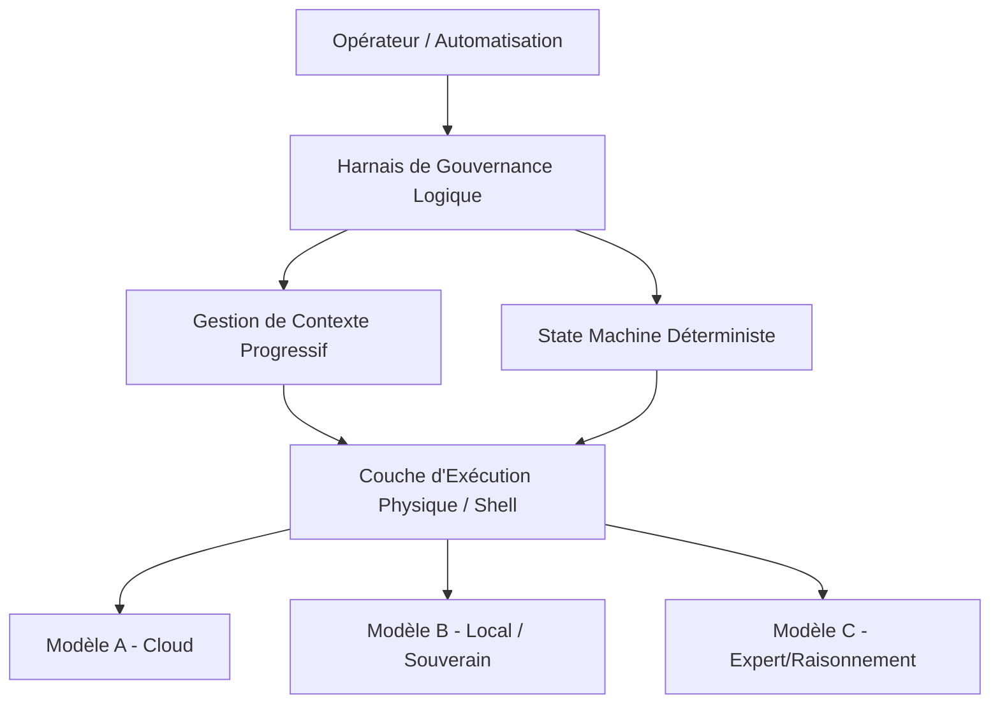
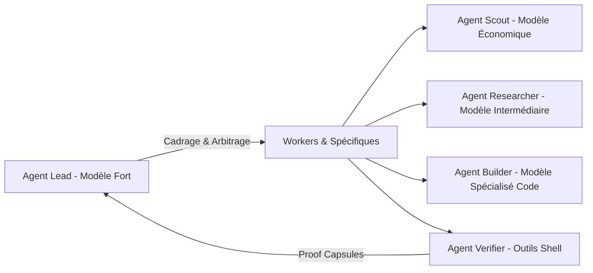

# Les Principes Fondamentaux d'un Excellent Harnais d'Agents (Harness Engineering)

L'ère de la génération massive de code par l'Intelligence Artificielle déplace le goulot d'étranglement de l'ingénierie logicielle. Alors que la capacité d'écriture de code devient quasi-infinie et peu coûteuse, **l'attention humaine, la taille des contextes LLM et la fiabilité des exécutions complexes** deviennent les ressources les plus rares et les plus précieuses.

C'est ici qu'intervient le **Harness Engineering** (l'ingénierie de harnais). Un harnais d'agents n'est pas un simple assistant de discussion interactif, ni un simple visualisateur de prompts. C'est l'environnement d'exécution, de sécurité, de gouvernance et de contrôle au sein duquel un agent IA ou une équipe d'agents évolue.

Ce document formalise les principes théoriques et architecturaux universels pour concevoir un harnais d'agents hautement performant, robuste et résilient.

---

## 1. Découplage de Couches et Portabilité Multi-Provider

Un excellent harnais d'agents doit être immunisé contre le "lock-in" d'un fournisseur unique de modèles. La tarification, l'accès, la vitesse de traitement et la souveraineté des modèles de langage de grande taille (LLM) sont des variables hautement volatiles.

### Séparation de la Logique et de l'Exécution

L'architecture d'un harnais doit séparer deux couches distinctes :
1. **La Couche d'Exécution Physique (Le Shell d'Exécution)** : Interface directe avec les LLM d'infrastructure, gestion du streaming des tokens, traitement des appels d'outils de bas niveau (Tool Calling), parsing de fichiers et rendering de l'état interactif (TUI/CLI).
2. **La Couche de Gouvernance Logique (Le Harnais de Contrôle)** : Gestion du contexte global, persistance de session (ledger événementiel), politiques de sécurité (policies), structures d'équipes, administration des boîtes de réception inter-agents (inbox), et validations logiques.



### Avantages de l'Abstraction :
- **Optimisation du coût et du chemin nominal** : Associer chaque tâche au modèle le plus adapté (un modèle de raisonnement performant pour le cadrage architectural, un modèle plus compact et très économique pour le parcours en lecture seule de l'arborescence).
- **Résilience opérationnelle** : Basculer d'un fournisseur à un autre de manière transparente en cas de panne, de hausse tarifaire ou de changement des conditions générales d'utilisation.

---

## 2. Le Paradigme "Think in Code"

L'un des plus grands facteurs d'échec des agents autonomes est la **saturation de contexte** (Context Overloading). Envoyer l'intégralité d'une base de code volumineuse dans le contexte de prompt d'un LLM génère du bruit, augmente les coûts de transaction, dégrade la précision et provoque l'effet de "compaction" où le modèle ignore les instructions importantes.

Le paradigme **"Think in Code"** modifie radicalement la posture de l'agent :

> **Règle fondamentale** : L'agent doit traiter l'infrastructure d'exécution comme un environnement de calcul local, et non comme un simple espace de stockage de données textuelles.

Plutôt que d'exécuter des dizaines de `tool calls` successifs (recherche de texte par grep, navigation de fichiers, listage de répertoires) qui consomment des tokens et nécessitent des allers-retours fastidieux avec le LLM, l'agent écrit un script ad hoc (Python, Bash, Node.js) pour effectuer l'analyse sur la machine exécutante. Le script est exécuté localement et ne renvoie au modèle que la synthèse finale ou les lignes critiques.

### Bénéfices :
- **Économie de contexte** : Réduction drastique (jusqu'à 100x) du volume de données transitant par l'API LLM.
- **Vitesse et Précision** : Le code déterministe tourne à la vitesse de la machine pour filtrer, agréger et isoler l'information, éliminant ainsi les approximations cognitives du LLM lors des recherches textuelles longues.

---

## 3. La State Machine Déterministe

S'il est admis qu'un LLM est extrêmement performant pour accomplir des tâches créatives ou d'écriture de code à l'intérieur d'une étape circonscrite, il s'avère hautement instable lorsqu'il s'agit de gérer les transitions globales d'un flux complexe d'ingénierie (par exemple, décider de passer de l'implémentation à la vérification, ou de la vérification à la rétrospective).

Un excellent harnais interdit l'auto-gouvernance temporelle de l'agent. Le cycle de vie d'une tâche doit être régi par une **State Machine (machine à états) codée de façon déterministe** :

```text
  [Intake]  -- (cadrage initial)
     │
     ▼
[Plan Required]  -- (génération du plan)
     │
     ▼
[Plan Approved]  -- (validation humaine ou mécanique)
     │
     ▼
[Implement]  -- (écriture et modification autonome)
     │
     ▼
  [Verify]  -- (execution des tests et mesures)
     │
     ▼
  [Review]  -- (validation par un agent tiers ou un humain)
     │
     ▼
  [Evidence]  -- (création de la Proof Capsule)
     │
     ▼
  [Close]  -- (archivage des traces et compilation des métriques)
     │
     ▼
[Retrospective]  -- (évaluation des apprentissages et gotchas)
     │
     ▼
[Completed]
```

### Mécanismes de Sécurité Événementielle :
- **Transitions par Gates** : Le passage de l'état `Implement` à `Verify` ne dépend pas d'un message en langage naturel du LLM disant "J'ai fini". Il nécessite la production d'un ensemble de fichiers modifiés sous forme de diff structuré.
- **Gestion des Échecs et Circuits Breakers** : Les états de défaillance (`blocked`, `needs_human`, `retry_cap_reached`, `aborted`) sont calculés programmatiquement par le harnais. Si le nombre d'itérations d'implémentation/vérification dépasse un seuil d'échec fixé dans le contrat de la tâche, le harnais verrouille la session active et lève un signal d'interruption.

---

## 4. L'Autonomie Contrôlée (Bounded Autonomy)

Les harnais trop restrictifs qui exigent une validation humaine pour chaque micro-action (lecture de fichier, exécution de commande inoffensive) éliminent le retour sur investissement d'un agent. Cependant, l'autonomie totale sur l'ensemble d'une machine présente des risques majeurs de sécurité, de suppression de fichiers ou de boucle infinie coûteuse.

Le compromis réside dans **l'Autonomie Contrôlée de type `allow-all` restreint**, définie par quatre piliers :

1. **Un but (Goal) strict et délimité** : Pas d'exécution asynchrone sans une clarification explicite du résultat opérationnel visé.
2. **Un plan approuvé** : Avant toute autonomie d'écriture, l'agent ou le lead de l'équipe produit un plan détaillé d'intervention. L'autorisation d'exécuter de manière autonome n'est débloquée qu'une fois ce plan validé par l'humain ou par un protocole de validation de haut niveau.
3. **Un périmètre (Scope) strict de fichiers et d'actions** : L'autonomie de manipulation de fichiers est contrainte à un sous-ensemble explicitement inclus dans la tâche. Toute tentative de modification hors de ces frontières provoque une erreur d'accès gérée par le harnais.
4. **Des limites physiques obligatoires** : Un budget de session strict (plafond de coût LLM cumulé, limite maximale de tokens d'entrée et de sortie, temps d'horloge maximal, profondeur de sous-agents maximale).

---

## 5. Le Concept de "Proof Capsules" (Preuves Vérifiables)

Dans le Harness Engineering, la déclaration textuelle d'un LLM n'a aucune valeur juridique ou de test. Un agent qui affirme "Les tests de non-régression s'exécutent avec succès" peut être sujet à l'hallucination ou à la complaisance pour clore une tâche difficile.

Le principe moderne est le suivant :

> **Règle fondamentale** : Remplacer la confiance déclarative par la collecte de preuves objectives de second niveau.

Chaque étape de validation réussie doit générer et consigner une **Proof Capsule** (Capsule de Preuve) locale, infalsifiable et auditable. Une Proof Capsule est un ensemble de métadonnées structurées comprenant :

- **L'identifiant du validateur** utilisé (un script de test standard, un linter de code, une commande d'assertion logicielle).
- **L'exacte commande exécutée** sur le système.
- **L'exit code exact (code de retour)** retourné par le système d'exploitation.
- **L'empreinte cryptographique (hash SHA-256)** de l'output d'exécution.
- **Les chemins d'artefacts secondaires** générés (par exemple, une image de capture d'écran d'un navigateur headless après test comportemental, la trace de performance ou de couverture de code).
- **L'horodatage précis** et un indicateur si des données sensibles ont été purgées (redacted).

Le harnais n'autorise la transition vers la clôture d'une tâche que si sa base de données d'événements contient les Proof Capsules valides exigées par la politique de qualité du système.

---

## 6. Équipes d'Agents Spécialisés et Optimisation Écologique

L'un des pièges les plus fréquents de l'orchestration agentique est l'utilisation d'un agent unique configuré sur un modèle haut de gamme colossal pour l'intégralité du cycle de vie de la tâche (de la lecture de dossiers à la modification du code, en passant par le requêtage de documentation externe). D'un point de vue économique, c'est l'équivalent de recruter un directeur technique sénior uniquement pour formater du texte.

### Le Modèle Écologique de Team-Building Agentique

Un excellent harnais d'agents organise le travail sous forme d'une équipe resserrée (3 à 5 membres maximum) aux rôles spécialisés, aux responsabilités isolées et aux coûts adaptés :



### Description des Rôles Standards :
* **Agent Lead (Le Superviseur - Modèle Fort)** : Responsable du cadrage logique, de la découpe des phases, de l'arbitrage en cas de désaccord entre agents et de la validation logique du plan. Il est l'unique interlocuteur avec l'opérateur humain.
* **Agent Scout (Le Détecteur - Modèle Économique/Ultra-Rapide)** : Chargé de parcourir la base de connaissances locale, de lire les arborescences et de localiser les fichiers sources concernés. Il opère exclusivement en lecture seule. Ses outputs sont des snippets précis et des chemins de fichiers.
* **Agent Researcher (L'Explorateur Terrestre - Modèle Intermédiaire)** : Dédié à la consultation des documentations externes, à l'exploration d'APIs tierces et à la synthèse de guides d'intégration.
* **Agent Builder (Le Développeur - Modèle Spécialisé)** : Dédié à l'implémentation de la logique, à la modification ou à la création d'artefacts. Il ne dispose pas des droits généraux d'exécution de commandes système de premier niveau afin d'éviter tout conflit d'intérêts sur la vérification.
* **Agent Verifier / Reviewer (Le Contrôleur - Modèle Fort/Raisonnement)** : Entité indépendante chargée d'auditer les modifications suggérées, d'exécuter les suites de tests formels, d'analyser le "blast radius" (impact collatéral) du code et de compiler la **Proof Capsule**.

### Contraintes d'Interraction :
- **Limitation de récursion** : Un agent de type Builder peut spawner un Scout ou un Researcher pour l'aider, mais ne peut en aucun cas créer un sous-Builder de manière infinie.
- **Isolement d'intérêt** : Le Builder qui écrit le code ne doit jamais être celui qui signe la boucle de clôture définitive. L'indépendance de l'évaluation prévient la complaisance logique.

---

## 7. La Boucle d'Apprentissage Fermée et Contrôlée (Closed-Loop Learning)

Un système d'agents n'a d'avenir industriel que s'il est capable d'apprendre de ses propres erreurs pour s'améliorer au fil du temps. Cependant, l'auto-modification en direct par un LLM de ses propres règles opérationnelles, de ses instructions système ou de ses outils est le chemin le plus court vers le drift doctrinal, l'effondrement logique ou des vulnérabilités critiques de sécurité (par injection de prompt).

Le Harness Engineering préconise une **Boucle d'Apprentissage Fermée et Contrôlée en 4 Étape**, qui élimine l'auto-mutabilité sauvage :

```text
       [1. Outcome de Tâche]
                 │
                 ▼
       [2. Phase Rétrospective]
                 │ (Isoler les gotchas, erreurs, limites d'outils)
                 ▼
    [3. Proposition d'Amendement]
                 │ (Écriture d'un diff d'apprentissage proposé)
                 ▼
      [4. Validation Humaine]
                 │ (Revue de risque, promotion vers les instructions)
                 ▼
 [5. Application et Proof Capsule]
```

### Distinction entre Mémoire Factuelle et Mémoire Procédurale
- **Mémoire Factuelle (Append-Only Ledger)** : Un registre immuable, consignant l'historique complet des événements réels d'exécution, des Proof Capsules et des scores d'outcomes. Elle est mise à jour de manière purement automatique au fil de l'eau.
- **Mémoire Procédurale (Playbooks, Instructions, Règles)** : Le socle d'instructions de haut niveau qui guide le comportement futur des agents. Cette mémoire est rigoureusement protégée. Les agents ne peuvent que rédiger des propositions d'amendement. Un humain ou un gardien de protocole séparé doit valider l'amendement après une évaluation claire du niveau de risque opérationnel avant de le fusionner dans le système central.

---

## Conclusion : La Règle d'Or du Harnais

Un bon harnais d'agents applique une règle d'or universelle :

> **Il doit être plus facile pour l'agent de produire un travail de haute qualité, documenté et vérifié par des preuves, que de contourner les règles.**

En structurant l'espace d'exécution par du code déterministe, en encadrant les accès, en systématisant les Proof Capsules et en s'appuyant sur des équipes d'agents éco-conçues, le Harness Engineering transforme l'IA générative d'un assistant stochastique impressionnant en un membre d'équipe fiable, auditable et industrialisé.
