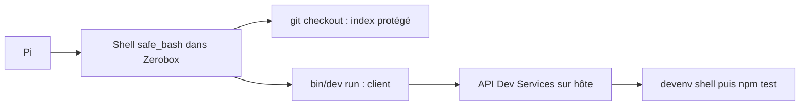

# Audit des sessions : safe_bash, Dev Services et SFW

Audit du 9 septembre 2026. Deux sous-agents `pi-expert` ont terminé leur investigation. Cette synthèse intègre leurs rapports et une vérification complémentaire du code et du service Dev Services installé. L’audit initial était en lecture seule. À la demande suivante de vérification, six sondes exécutables ont été ajoutées et exécutées sur le backend réel et sur l’hôte. Aucune dépendance installée ni configuration n’a été modifiée. Les fichiers créés sont ce rapport et la sonde liée en fin de document.

**Le modèle n’était pas obligé de créer `/tmp/shellkeep`. Il a choisi une sauvegarde temporaire pour comparer ses modifications avec `HEAD`. L’utilisateur a ensuite précisé avoir refusé l’opération Git dans `pi-permission-system` : le blocage était attendu et ne constitue pas un défaut d’utilisabilité. L’accès hôte par Dev Services est également un choix assumé. Le problème à traiter est l’intégration SFW : écriture de cache interdite, puis tunnel réseau refusé.**

## Périmètre et modèles réellement enregistrés

| Repère | Session | Objet | Modèle enregistré |
| --- | --- | --- | --- |
| S1 | `01a08335-8a98-7431-b05a-1f396b3d6b79` | Migration Quickcoin/Finmark vers Dev Services | `cpa/gemini-3.8-flash` |
| S2 | `01a08634-38ca-7069-8682-3608c79ee64e` | Hermes, fournisseurs Pi, installation SFW | Gemini Flash au début, puis `openai-codex/gpt-5.6-terra` |
| S3 | `01a08427-a0e0-73a0-924a-be922941e7e9` | Modifications de la boutique Shein, dont `/tmp/shellkeep` | Principalement `opencode-go/muse-spark-1.3-contributor` |

**L’extrait fourni appartient à S3, pas à S1.** S1 ne contient pas `shellkeep`. S2 passe à Terra à la ligne 115, avant toute la phase SFW. L’incident SFW est donc bien attribuable à une exécution menée par Terra. Ces identifiants proviennent des messages enregistrés, sans vérification indépendante de l’identité des modèles derrière les alias CPA.

Sources : [S1](../../agent/sessions/--home-abdwhb-projects--/2026-09-08T22-48-39-320Z_01a08335-8a98-7431-b05a-1f396b3d6b79.jsonl:1), [S2, changement de modèle](../../agent/sessions/--home-abdwhb-.pi--/2026-09-09T12-46-04-491Z_01a08634-38ca-7069-8682-3608c79ee64e.jsonl:115), [S3, commande shellkeep](../../agent/sessions/--home-abdwhb-projects-shein-ecom--/2026-09-09T03-13-04-736Z_01a08427-a0e0-73a0-924a-be922941e7e9.jsonl:620).

## F1 — `/tmp/shellkeep` : une précaution choisie pour une expérience

Le modèle voulait sauvegarder `storefront-shell-links.ts` et `storefront-footer.tsx`, remettre temporairement leurs versions `HEAD`, relancer le test, puis restaurer ses modifications. La sauvegarde répondait à cette stratégie de diagnostic. Aucun outil ne lui imposait ce nom de dossier ni cette procédure.

Le choix de `/tmp` était compatible avec le sandbox. Le résultat enregistre `tmpNamespace: host`. Il ne s’agissait donc pas, dans cet incident, du problème historique de fichiers temporaires visibles uniquement dans un namespace privé. La politique actuelle `bash-general` partage également `/tmp` avec l’hôte. [Résultat S3](../../agent/sessions/--home-abdwhb-projects-shein-ecom--/2026-09-09T03-13-04-736Z_01a08427-a0e0-73a0-924a-be922941e7e9.jsonl:621), [politique du profil](../../agent/extensions/sandbox/runtime/policies.ts:523).

Une comparaison avec `HEAD` aurait pu être pertinente pour distinguer régression et défaut préexistant, mais cette manipulation n’était pas nécessaire pour commencer le diagnostic. La stack pointait déjà vers `use-active-url.ts:9`, avec `ReferenceError: window is not defined`, pendant un rendu serveur dans un environnement de test Node. Ce hook constituait une piste plus directe que le remplacement des deux fichiers de présentation. Lire le hook, le test et leur historique aurait permis de préciser l’hypothèse avant de modifier temporairement le checkout. [Stack S3](../../agent/sessions/--home-abdwhb-projects-shein-ecom--/2026-09-09T03-13-04-736Z_01a08427-a0e0-73a0-924a-be922941e7e9.jsonl:619).

## F2 — Git a été bloqué et le shell a masqué l’échec global

La séquence avait cette structure :

```text
sauvegarde && git checkout HEAD -- fichiers && test filtré
;
restauration && echo RESTORED && git status
```

Les sauvegardes ont réussi, puisque le shell a atteint `git checkout`. Git a ensuite échoué en créant `.git/index.lock`. Le `&&` a empêché le lancement du test. Après le `;`, les copies de restauration et `git status` ont réussi.

Le résultat contient donc simultanément :

```text
fatal: Unable to create '…/.git/index.lock': Permission denied
RESTORED
```

et les métadonnées :

```text
status=sandboxed, backend=zerobox, outcome=succeeded, exitCode=0
```

**Le code 0 est celui de la dernière commande du shell. Il ne valide pas l’expérience.** `safe_bash` rapporte correctement ce code. C’est la composition de la commande qui rend son statut global trompeur. Le transcript conserve heureusement l’erreur Git. Il ne prouve ni un test réussi sur `HEAD`, ni une perte des deux fichiers. [Résultat complet S3](../../agent/sessions/--home-abdwhb-projects-shein-ecom--/2026-09-09T03-13-04-736Z_01a08427-a0e0-73a0-924a-be922941e7e9.jsonl:621), [remontée du résultat processus](../../agent/extensions/_shared/command-execution/exec.ts:443).

**Correction après précision de l’utilisateur : l’opération Git avait été refusée volontairement dans `pi-permission-system`. Le blocage doit être considéré comme attendu.** L’audit initial attribuait trop directement cet incident à la protection `.git` de Zerobox. Cette protection existe bien dans le code, mais sa présence ne suffit pas à reconstituer la chaîne exacte de la décision utilisateur dans cet appel. Le montage exact de S3 n’a pas été capturé au moment de l’échec. Le point restant est seulement la différence entre succès de la restauration et succès du test, pas une permission à élargir. [Règles Zerobox](../../../projects/shared-services/sandboxes/zerobox/crates/zerobox-protocol/src/permissions.rs:550), [montages enregistrés dans S1](../../agent/sessions/--home-abdwhb-projects--/2026-09-08T22-48-39-320Z_01a08335-8a98-7431-b05a-1f396b3d6b79.jsonl:243).

Les pipelines `test | grep | head` ajoutent une autre fragilité : sans préservation explicite du statut du test, la sortie finale dépend aussi des filtres. Il faut distinguer résultat du test et sélection de son affichage. Ajouter seulement `set -e` ne remplace pas une gestion correcte de la restauration et des codes de sortie.

## F3 — S1 : Dev Services fonctionne par son API, pas par tous les accès hôte

Trois observations expliquent les contradictions apparentes de cette session.

- **E1 — Le chemin prévu fonctionne.** La découverte du CLI et `/api/health` réussissent. Les commandes `dev-services service-up mysql84` et `service-up mailpit` réussissent ensuite, et `dev-services status` voit les services prêts. [S1, health](../../agent/sessions/--home-abdwhb-projects--/2026-09-08T22-48-39-320Z_01a08335-8a98-7431-b05a-1f396b3d6b79.jsonl:184), [démarrage](../../agent/sessions/--home-abdwhb-projects--/2026-09-08T22-48-39-320Z_01a08335-8a98-7431-b05a-1f396b3d6b79.jsonl:204), [statut](../../agent/sessions/--home-abdwhb-projects--/2026-09-08T22-48-39-320Z_01a08335-8a98-7431-b05a-1f396b3d6b79.jsonl:210).
- **E2 — Les sondes hôte rencontrent les limites du sandbox.** `dev-infra.sh verify all` tente une écriture interdite dans `imports.txt`. `systemctl --user` échoue sur l’accès au D-Bus. Les sondes `nc` directes sont refusées alors que l’API voit les services prêts. Cela ne démontre pas une panne des services : le processus sandboxé n’a pas tous les accès du service hôte. [S1, vérification et D-Bus](../../agent/sessions/--home-abdwhb-projects--/2026-09-08T22-48-39-320Z_01a08335-8a98-7431-b05a-1f396b3d6b79.jsonl:186), [sondes réseau](../../agent/sessions/--home-abdwhb-projects--/2026-09-08T22-48-39-320Z_01a08335-8a98-7431-b05a-1f396b3d6b79.jsonl:206).
- **E3 — Certaines erreurs viennent de commandes devinées.** `/api/services` et `/api/worktrees` renvoient 404. `dev-services list` n’existe pas. Ces erreurs relèvent de l’usage du CLI/API, indépendamment du confinement. [S1, routes](../../agent/sessions/--home-abdwhb-projects--/2026-09-08T22-48-39-320Z_01a08335-8a98-7431-b05a-1f396b3d6b79.jsonl:190), [commande list](../../agent/sessions/--home-abdwhb-projects--/2026-09-08T22-48-39-320Z_01a08335-8a98-7431-b05a-1f396b3d6b79.jsonl:198).

Le problème d’ergonomie est réel. La description de `safe_bash` expose surtout ses catégories Guard et ses redirections vers les outils natifs. Elle ne résume pas la protection Git, le réseau effectif, les ports hôte relayés ou l’absence d’accès au D-Bus. Le skill Dev Services décrit les commandes et l’API, mais son texte actuel ne mentionne ni `safe_bash` ni le sandbox. Le modèle doit donc reconstituer la compatibilité entre les deux contrats. [Description safe_bash](../../agent/extensions/bash-execution/safe-bash/description.ts:20), [skill Dev Services](../../../.agents/skills/dev-services/SKILL.md:73).

## F4 — Le cadenas ne décrit pas toute l’exécution Dev Services

**Ce fonctionnement est un choix assumé, pas une anomalie à corriger.** L’accès au port Dev Services `18740` figure explicitement dans le contrat d’intégration du sandbox. Le test vérifie également qu’un port non autorisé reste inaccessible. Ce test a été lu, pas exécuté pendant l’audit. [Contrat d’intégration](../../agent/extensions/sandbox/runtime/safe-bash-fork-contract.integration.test.ts:30).

**Un processus lancé par `./bin/dev run` est exécuté par l’API Dev Services côté hôte. Il n’hérite pas automatiquement du sandbox du CLI appelant.**



Le CLI transmet les arguments par WebSocket. `runtime.openRun` prépare l’environnement et appelle un lanceur local côté API. Le lanceur sans terminal utilise `spawn`, sans appel à Zerobox. Ce comportement existe également dans le bundle installé `apps/api/dist/index.js`, pas seulement dans les sources. [Relais CLI](../../../projects/shared-services/dev-services/apps/cli/src/index.ts:447), [openRun](../../../projects/shared-services/dev-services/packages/core/src/runtime.ts:1833), [spawn](../../../projects/shared-services/dev-services/packages/core/src/runtime.ts:472), [bundle installé](../../../projects/shared-services/dev-services/apps/api/dist/index.js:4524).

La vérification en lecture seule du service actif montre `PrivateNetwork=no`, `PrivateTmp=no`, `ProtectHome=no`, `ProtectSystem=no` et aucun `ReadOnlyPaths`. Cette vérification décrit le service actuel, pas une capture rétroactive des processus des sessions.

Conséquence : dans une même commande composite, Git peut être bloqué par Zerobox tandis que le test, s’il est lancé via Dev Services, s’exécute avec les accès du service hôte. Ce sont deux lieux d’exécution. L’accès à cette API constitue une délégation d’autorité qu’il faut rendre explicite. Le cadenas du lanceur ne suffit pas à garantir un confinement de bout en bout. Aucune exploitation de cette frontière n’a été testée pendant l’audit.

## F5 — SFW : échec d’intégration, pas preuve de téléchargement protégé

Toute cette séquence de S2 est exécutée par Terra.

| Étape | Commande ou événement | Preuve et interprétation |
| --- | --- | --- |
| T1 | `sfw --version` | Échec `EROFS` sur `~/.local/lib/node_modules/sfw/.sfw-cache/next-check`. Le wrapper essaie d’écrire avant de lancer le binaire. |
| T2 | `SFW_SKIP_UPDATE_CHECK=1 sfw --version` | Réussite, version `1.15.1`. Le binaire était déjà en cache. |
| T3 | `SFW_SKIP_UPDATE_CHECK=1 sfw pi install npm:pi-hermes-memory@0.9.8` | Échec `Proxy response (403) !== 200 when HTTP Tunneling`, puis code 137. Aucune installation réussie n’est démontrée. |
| T4 | L’utilisateur indique avoir mis à jour Hermes | La lecture suivante confirme la version `0.9.8`. Ce succès ne provient pas de T3. |

Sources : [T1](../../agent/sessions/--home-abdwhb-.pi--/2026-09-09T12-46-04-491Z_01a08634-38ca-7069-8682-3608c79ee64e.jsonl:247), [T2](../../agent/sessions/--home-abdwhb-.pi--/2026-09-09T12-46-04-491Z_01a08634-38ca-7069-8682-3608c79ee64e.jsonl:274), [T3](../../agent/sessions/--home-abdwhb-.pi--/2026-09-09T12-46-04-491Z_01a08634-38ca-7069-8682-3608c79ee64e.jsonl:276), [T4](../../agent/sessions/--home-abdwhb-.pi--/2026-09-09T12-46-04-491Z_01a08634-38ca-7069-8682-3608c79ee64e.jsonl:356).

**Le premier obstacle est établi précisément.** Le wrapper SFW écrit dans son répertoire d’installation global, hors des écritures autorisées dans ce sandbox. Son code confirme l’écriture de `next-check`. `SFW_SKIP_UPDATE_CHECK=1` désactive la vérification de mise à jour du wrapper, pas le filtrage de sécurité. Cette option ne résout pas le premier téléchargement si le binaire n’est pas déjà présent. [Code installé du wrapper](../../../.local/lib/node_modules/sfw/dist/sfw.mjs:2188).

**Le complément exécutable localise désormais deux problèmes réseau distincts.** Les appels API de SFW vers `firewall-api.socket.dev` sont refusés par le proxy de Zerobox. Les connexions de SFW vers la destination finale tentent une résolution DNS directe, impossible dans ce namespace. Même GitHub, pourtant autorisé et accessible avec `curl` seul, échoue sous `sfw curl`. Les sondes ont reproduit le message de tunnel 403 et le code 137. Ce code ne prouve donc pas un OOM. Le détail des contrôles et leur portée figurent en fin de document.

Le contexte enregistré autorise notamment GitHub et quelques ports locaux, mais ne montre pas une politique complète pour un parcours registre npm et services Socket. Un autre appel `pi -p`, sans SFW, échoue déjà avec `403 Domain not in allowlist`. Cette commande rapporte séparément `Live session indexing failed: disk I/O error`. L’erreur d’indexation Hermes nécessite son propre diagnostic. La réussite de `pi --list-models` ne valide pas une requête réelle à un fournisseur LLM. [Appel Pi et erreurs](../../agent/sessions/--home-abdwhb-.pi--/2026-09-09T12-46-04-491Z_01a08634-38ca-7069-8682-3608c79ee64e.jsonl:261).

La documentation officielle décrit SFW Free comme un proxy qui bloque les téléchargements réseau de paquets reconnus malveillants. Il n’inspecte pas rétroactivement un artefact servi depuis un cache local. Un numéro de version affiché ou un paquet trouvé installé ne prouve donc pas qu’un téléchargement a traversé sa protection. [Documentation Socket Firewall Free](https://docs.socket.dev/docs/socket-firewall-free).

Les 29 appels `safe_bash` de S2 sont enregistrés sous Zerobox : 19 réussites, 9 échecs et un timeout. Ce décompte mélange plusieurs opérations, dont des tests, et ne mesure pas un taux d’échec du sandbox. Aucun appel Dev Services n’existe dans cette session. Aucun passage réussi hors de Zerobox par les appels SFW observés n’est démontré.

À côté de l’incident, le skill d’installation présente aussi une divergence documentaire à corriger : il liste `sfw bun` comme pris en charge, alors que la liste officielle de SFW Free ne garantit pas les autres gestionnaires que npm/yarn/pnpm pour JavaScript. L’intégration native Bun est une autre voie. Ce point n’explique pas T3, qui n’utilise pas `sfw bun`. [Skill local](../../../.agents/skills/dependency-installation/SKILL.md), [liste officielle](https://github.com/SocketDev/sfw-free).

## F6 — Accessibilité pour des modèles à faible coût

**Usage courant : démontré sur certaines opérations. Installation protégée de bout en bout : non démontrée ici. Fiabilité comparative des modèles économiques : non mesurée.** Les refus utilisateur et l’accès hôte délibéré de Dev Services ne doivent pas être comptés comme des échecs des modèles ou du sandbox.

Gemini Flash utilise effectivement le CLI Dev Services, démarre des services et récupère leur état. Muse utilise le lanceur du projet pour ses tests. Terra sait contourner de façon limitée l’auto-vérification du wrapper SFW, mais ne peut pas achever l’installation sous les contraintes réseau rencontrées.

L’incident SFW ne démontre pas une insuffisance du modèle. Il révèle un parcours d’installation qui rencontre des contraintes d’intégration. Clarifier les erreurs et les restrictions reste utile, mais cette clarification ne rendra pas une installation possible tant que le problème technique persiste.

Ces sessions ne constituent pas un benchmark comparatif : les tâches, contextes et modèles diffèrent. S1 compte 122 appels `safe_bash`, contre 29 pour S2, mais comparer ces nombres comme une mesure d’efficacité serait trompeur. Il manque des scénarios identiques, des répétitions, le coût total et le nombre d’interventions humaines par scénario.

## Améliorations proposées, sans implémentation dans cet audit

- **A1 — Exposer le contrat effectif.** Fournir au modèle un résumé calculé du profil, des chemins protégés, des ports relayés, du proxy obligatoire et du lieu réel d’exécution. Pour Dev Services, distinguer explicitement le client sandboxé du processus lancé par l’API hôte. Ne pas recopier une liste statique susceptible de diverger de la politique réelle.
- **A2 — Préparer un parcours SFW compatible.** Les sondes complémentaires conduisent à recommander un exécuteur hôte contrôlé pour les commandes de dépendances approuvées, avec SFW obligatoire. Le déplacement doit être explicite et respecter la décision de permission. Réutiliser le SFW existant. Ne pas considérer `sfw --version` comme test d’intégration suffisant.
- **A3 — Préserver les résultats des étapes.** Séparer lecture, test et restauration, ou utiliser une procédure qui conserve le code du test et garantit le nettoyage. Éviter la restauration temporaire du checkout pour une simple inspection de `HEAD`. Ne pas remplacer les codes de sortie par une heuristique basée sur la présence du mot `fatal` dans les logs.
- **A4 — Évaluer les modèles sur des scénarios reproductibles.** Tester un démarrage Dev Services, un test applicatif volontairement rouge, une écriture Git refusée et une installation SFW. Mesurer succès complet, appels inutiles, temps actif, coût et interventions humaines. Vérifier aussi que le modèle identifie correctement le lieu d’exécution et ne cherche pas à contourner une interdiction.

## Limites de validation

Les deux rapports délégués sont terminés et ont été intégrés. Les preuves historiques viennent des JSONL, les explications d’implémentation du code actuel, du bundle Dev Services installé et de propriétés systemd lues sur le service actif. Les captures analysées contiennent 644 lignes pour S1, 380 pour S2 et 819 pour S3.

Aucun test applicatif, `npm install`, `pi install`, changement de permissions ou redémarrage de service utilisateur n’a été exécuté. Le complément a lancé des processus de diagnostic isolés, des requêtes réseau et un `npm pack --dry-run --ignore-scripts` sous SFW côté hôte. Ses répertoires temporaires ont été supprimés. Une installation complète et le rejet d’un paquet interdit restent à valider, de même que la fiabilité statistique avec des modèles économiques.

## Priorité précisée après les corrections de l’utilisateur

Conserver le fonctionnement de Dev Services et les refus de permissions. Concentrer la correction sur SFW dans cet ordre :

1. **A2a — Retirer la préinstallation proposée.** SFW est déjà installé. Sa préparation manuelle et la désactivation durable de ses mises à jour ne sont pas la correction recommandée. `SFW_SKIP_UPDATE_CHECK=1` a uniquement servi à isoler le premier obstacle pendant les sondes.
2. **A2b — Placer SFW sur un chemin réseau compatible.** Pour conserver SFW Free, exécuter les commandes de dépendances approuvées dans un exécuteur hôte contrôlé, comme le fait Dev Services pour les projets enregistrés. Réutiliser l’installation actuelle de SFW et son fonctionnement normal de mise à jour. Pour le harness `~/.pi`, un parcours d’exécution hôte explicitement autorisé reste à intégrer : le test côté hôte ne signifie pas qu’un tel outil Pi existe déjà. Ne pas présenter une simple extension de la liste des domaines comme une réparation du problème de DNS direct.
3. **A1 — Intégrer le chemin validé dans le harness.** Conserver les commandes habituelles du modèle et prendre en charge les prérequis dans l’intégration. Renvoyer des erreurs distinguant refus utilisateur, préparation SFW, réseau refusé et résultat du gestionnaire de paquets. Ne pas demander au modèle de reconstruire ce diagnostic à chaque installation.
4. **A4 — Prouver le parcours avant de comparer les modèles.** Tester une installation bénigne depuis un cache de paquets vide dans un projet jetable, un refus de sécurité contrôlé et un refus réseau explicite. Vérifier les codes de sortie, l’absence de poursuite de l’installation après un refus et les preuves du passage réseau par SFW. Répéter ensuite le même scénario avec les modèles économiques, en comptant les interventions humaines et les appels inutiles.

## Vérification exécutable complémentaire : résultats établis

Les sondes importent le vrai `loadSandboxConfig`, `createSandboxService` et `createZeroboxBackend`. Elles utilisent la configuration actuelle de `~/.pi`, sans élargir ses permissions et sans agir dans la session source. Ce sont des tests au niveau du backend réel, pas un rejeu du modèle ni de toute l’interface Pi.

| Repère | Sonde | Résultat |
| --- | --- | --- |
| V1 | Installation locale | Wrapper npm `sfw` **2.0.6**, binaire déjà en cache **1.15.1**. |
| V2 | `sfw --version` dans Zerobox | Code 1, `EROFS` sur `.sfw-cache/next-check`. Avec `SFW_SKIP_UPDATE_CHECK=1`, code 0 et version 1.15.1. |
| V3 | `curl -I https://github.com` dans Zerobox | HTTP 200, code 0. Le même appel avec SFW échoue avec `getaddrinfo EAI_AGAIN github.com`, code 56. |
| V4 | Requêtes vers registre npm et API Socket | `registry.npmjs.org` et `firewall-api.socket.dev` renvoient 403 avec `x-proxy-error: blocked-by-allowlist`. SFW sur le registre reproduit aussi l’erreur de tunnel et le code 137. |
| V5 | Proxy local contrôlé qui refuse CONNECT | Avec `NODE_USE_ENV_PROXY=1`, comme injecté par Zerobox, SFW demande `firewall-api.socket.dev:443`. Le refus contrôlé reproduit exactement le message 403 et le code 137. Un contrôle avec `curl` vérifie que la sonde proxy fonctionne. |
| V6 | Binaire SFW actuel côté hôte avec `npm pack pi-hermes-memory@0.9.8 --dry-run --ignore-scripts --json` | Code 0, paquet 0.9.8 décrit avec taille 420149 octets et intégrité SHA-512. Cache npm neuf et HOME temporaires. Aucun paquet installé, aucun script de paquet exécuté. |

Une sonde intermédiaire côté hôte, avec un proxy amont refusant tout, a également obtenu HTTP 206 sur une requête d’un octet au tarball public sans que ce proxy reçoive le CONNECT vers le registre. Cela correspond à la différence entre les connexions de destination et les appels API via `fetch`. Les premières tentatives de la sonde API omettaient `NODE_USE_ENV_PROXY=1` et n’observaient donc aucun appel API au proxy. Cette omission a été corrigée après lecture du patch d’environnement réellement appliqué par Zerobox.

Cette limitation est cohérente avec la documentation Socket : le tableau Free/Enterprise indique **« Chained HTTP Proxy : No »** pour Free. Le document date d’octobre 2025, mais les sondes vérifient directement le comportement du binaire 1.15.1 installé aujourd’hui. [Document Socket](https://socket.dev/blog/socket-firewall-enterprise), [injection Node du fork Zerobox](../../../projects/shared-services/sandboxes/zerobox/scripts/upstream-node-env-proxy.patch:15).

Le défaut du wrapper est également précis : `ensureLatestBinary()` trouve le binaire en cache, puis appelle `setNextCheckTimeSync()` avant le bloc qui tolère un échec de mise à jour. L’erreur `EROFS` interrompt donc le lancement avant le retour du binaire déjà présent. Une éventuelle correction amont doit permettre le repli explicite vers ce cache valide quand le marqueur ne peut pas être écrit, avec un diagnostic, tout en conservant les mises à jour quand elles sont possibles. Elle ne résoudrait pas à elle seule l’incompatibilité réseau. [Code installé](../../../.local/lib/node_modules/sfw/dist/sfw.mjs:2275).

Résultat final de la sonde : **6 tests réussis, 0 échec, 23 assertions, 8,37 secondes**. Les premières itérations contenaient des hypothèses de sonde invalidées et une erreur de lecture du JSON npm 12, qui renvoie ici un objet indexé par nom de paquet. Elles ont été corrigées sans modification de production. Les tests finaux vérifient la reproduction des défauts : leur réussite ne signifie pas que le runtime a été réparé.

Le succès V6 établit un téléchargement par le binaire SFW en mode wrapper côté hôte. Ce test invoque directement le binaire déjà en cache, afin de ne pas déclencher l’auto-mise-à-jour du lanceur npm pendant un diagnostic. Il ne prouve pas encore le rejet d’un paquet interdit ni une installation complète avec toutes ses dépendances. Aucune mise à jour du wrapper, du binaire SFW, de npm ou de Hermes n’a été effectuée.

Sonde reproductible : [sfw-runtime-probe.test.ts](./sfw-runtime-probe.test.ts). L’exécution est conditionnée par `SFW_AUDIT_PROBE=1` et effectue les requêtes publiques décrites ci-dessus.
