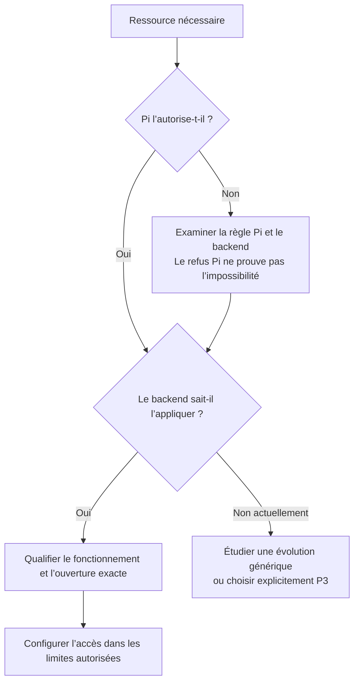

# Limites techniques et choix restant à trancher

Document historique de conception : les constats ci-dessous décrivent l’investigation initiale en lecture seule et les décisions validées avant implémentation. Consulte le [rapport de livraison](./2026-09-10-sandbox-generalisation-execution.md) pour le candidat désormais développé, sa qualification et ses limites actuelles. Aucune activation personnelle n’a été effectuée.

## Ce qui est déjà décidé

- **Q1 / D8 :** `/tmp` privé par défaut; partage complet du `/tmp` hôte possible en P2 sur configuration explicite, avec exclusions conservées et Think privé.
- **Q3 / D9 :** première version destinée à Linux natif et WSL.
- **Q2 :** question retirée. Aucune liste d’outils ne doit définir les limites de l’architecture. Établis les mécanismes possibles avant de demander des compromis d’ouverture.

## Sources correspondant à l’installation

Le binaire `~/.pi/bin/zerobox` annonce `0.3.3-fork.17`. Son SHA-256 est `1a8202290afac9a4f8396ef7e0d8918cbcf82c4a89ebe6c303c3536e04aad53d`, identique à la provenance Pi dans `agent/extensions/sandbox/runtime/zerobox-provenance.json`.

Cette provenance désigne le commit source `5c530891c2883bfbfd192883002cfc9b0f50e632`, présent dans `~/projects/shared-services/sandboxes/zerobox-local-capabilities`. Les hashes des patches de filtrage réseau, IPC privé, écoute locale et routage des domaines hôte correspondent à ceux enregistrés pour le binaire.

Le checkout principal `~/projects/shared-services/sandboxes/zerobox` est plus ancien et contient des modifications locales. Il n’a pas été utilisé comme preuve finale de l’installation. Aucun checkout n’a été modifié.

## Possibilités et limites observées

| Référence | Mécanisme | Constat | Travail nécessaire |
| --- | --- | --- | --- |
| **F1** | Fichiers et dossiers | Pi compile les lectures, écritures et exclusions vers Zerobox. Le socle shell lit actuellement `/` sauf exclusions. | Réduire le socle sans perdre les exécutables et bibliothèques nécessaires. Qualifier Linux et WSL séparément. |
| **F2** | `/tmp` | Les namespaces privé et hôte existent dans la politique. Le mode hôte omet `--private-tmp`. | Intégrer D8 aux nouveaux fichiers et tester la visibilité croisée, les exclusions et Think. |
| **F3** | Connexions TCP sortantes et services hôte | Le transport géré filtre les destinations. Des ports loopback hôte explicitement autorisés peuvent être atteints; les routes de domaines hôte existent aussi. | Qualifier les protocoles et chemins de connexion précis. Ne pas confondre support TCP et compatibilité universelle des clients. |
| **F4** | Serveur TCP lancé dans le sandbox | `--allow-local-binding` autorise une écoute dans le namespace réseau privé. | Distinguer serveur utilisable entre processus sandboxés et serveur joignable depuis un navigateur sur l’hôte. Une publication hôte contrôlée n’est pas fournie par ce flag seul. |
| **F5** | IPC privé entre processus | Les paires de sockets Unix de type stream sont permises pour l’IPC privé, notamment les flux de sous-processus. | Conserver ce support. Il ne donne pas accès aux sockets Unix nommés d’un service hôte. |
| **F6** | Sockets Unix nommés | Pi refuse l’ouverture globale; les filtres du backend correspondant interdisent aussi les créations de sockets permettant ces connexions en mode réseau géré. | Concevoir et valider une évolution générique si cet accès doit être proposé en P2. Un montage de chemin seul ne résout pas le filtrage système. |
| **F7** | UDP et sockets bruts | Le mode réseau géré est TCP; ses filtres interdisent UDP et les sockets bruts. | Étudier un transport et des règles génériques avant de promettre du support. Une entrée `allowedDomains` ne suffit pas. Ne pas assimiler cette restriction du backend actuel à une impossibilité de Linux. |
| **F8** | Chemins Windows sous WSL | Pi inscrit `/mnt/c` dans ses interdictions fixes. | Distinguer autorisation de lire un chemin monté, ouverture d’IPC et lancement d’un exécutable Windows. Le premier refus observé est une politique Pi; les autres parcours ne sont pas qualifiés. |
| **F9** | Variables, PATH, HOME | Pi prépare les variables et utilise un PATH comportant des emplacements de produits. | Définir des ressources et un PATH génériques, sans accorder de droits par simple présence d’un exécutable. |

Sources techniques : `agent/extensions/sandbox/runtime/{policies,contracts,zerobox-backend}.ts`, puis dans le worktree source identifié, `README.md`, `crates/zerobox/src/sandbox.rs`, `crates/zerobox/tests/sandbox/net.rs` et les patches `upstream-proxy-routed-socket-filter`, `upstream-private-stream-ipc`, `upstream-local-test-network` et `upstream-host-domain-routing`.

Les tests présents dans les sources ont été lus, pas relancés. Leur existence n’est pas une preuve d’exécution sur les deux plateformes cibles.

## La séparation à conserver

Ne classe pas directement un produit en P3. Ne présente pas non plus les limitations actuelles de Zerobox comme déjà supprimées. Une évolution envisagée reste soumise à une preuve technique et au choix de son périmètre.

## Question active

**Q4 — Validée.** Prévois une évolution générique et configurable de Zerobox lorsque le mécanisme retenu le nécessite, avec validation avant activation. Cette décision définit le périmètre du plan; la phase courante reste la conception.

**Q5 — Validée.** Les serveurs restent privés par défaut. Permets une publication vers la machine hôte et, sur configuration distincte, vers le réseau local, avec adresse et ports précis. Qualifie les transports et le cycle de vie de la publication avant activation.

**Q6 — Validée / D12.** Autorise le service via son socket précis, dans les permissions du service. N’exige pas de filtrage des actions propre au protocole. La précision du socket ne réduit pas les pouvoirs que le service accorde. Conserve la politique Docker via broker déjà retenue.

Pour WSL, conserve la frontière déjà choisie entre P2 et P3 : qualifie l’accès ciblé aux fichiers montés en P2 et réserve l’exécution utilisant la session hôte Windows à P3 explicite. Microsoft documente que les exécutables Windows lancés depuis WSL tournent sous l’utilisateur Windows actif et apparaissent comme des processus Windows. Cette documentation ne prouve pas leur confinement par Zerobox. Ne confonds pas autorisation d’un chemin Windows et isolation d’un exécutable Windows. Source : [Interopérabilité WSL](https://learn.microsoft.com/en-us/windows/wsl/filesystems#run-windows-tools-from-linux).

**Q7 — Validée.** Réserve le support UDP ciblé au lot ultérieur A7. Livre d’abord les autres mécanismes retenus, avec refus explicite des demandes UDP non prises en charge et sans fallback hôte. Distingue les protocoles dès maintenant dans le modèle de ressources. Qualifie ultérieurement UDP avec destinations et ports explicites, sans en déduire le support du multicast, des sockets bruts ou de la publication UDP entrante.

Le socle de lecture minimal reste une qualification technique à effectuer, pas une liste de produits à faire choisir.
