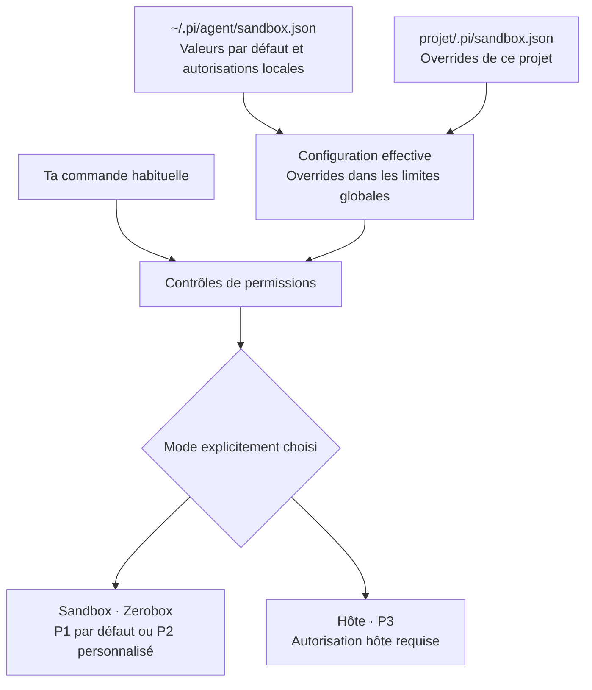
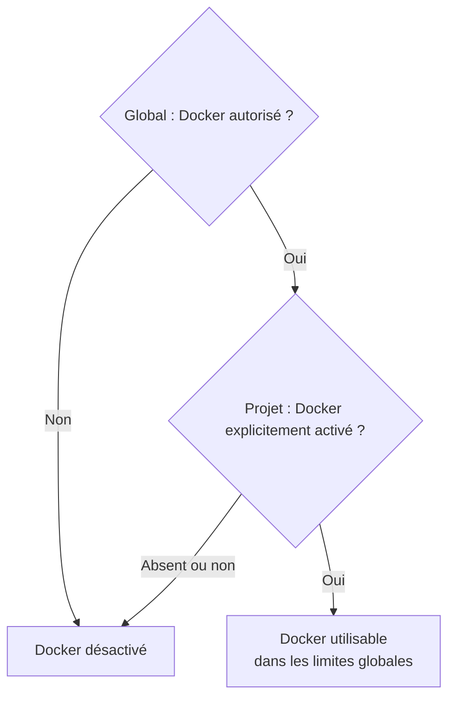

# Sandbox Pi : direction implémentée

**Un sandbox générique, isolé par défaut et personnalisable, qui conserve tes commandes habituelles. Deux fichiers de configuration. Docker autorisé globalement, activé volontairement par projet.**

Synthèse du [plan détaillé](./2026-09-10-sandbox-generalisation.md). Le candidat est implémenté dans les worktrees et qualifié sous WSL. Consulte le [rapport de livraison](./2026-09-10-sandbox-generalisation-execution.md) pour les preuves et les limites. L’installation personnelle n’est pas activée.

## Fonctionnement général

Une commande refusée ou incompatible ne bascule jamais automatiquement sur l’hôte.

## Profils et décisions : deux choses distinctes

**Les profils P décrivent l’exécution.**

| Profil | Comportement |
| --- | --- |
| **P1 — Sandbox par défaut** | Lectures limitées au projet et au socle des outils, réseau fermé, `/tmp` privé. Ces valeurs sont personnalisables. |
| **P2 — Sandbox personnalisé** | Le même moteur applique tes ressources autorisées ou tes restrictions supplémentaires. Aucun bouton P2 à activer après modification de la configuration. |
| **P3 — Hôte explicite** | Exécution hors de Zerobox, sélectionnée et autorisée volontairement. Les permissions sur les commandes restent actives. |

**Les décisions D fixent l’architecture. Ce ne sont pas des profils.**

| Décision | Engagement |
| --- | --- |
| **D1** | Commencer avec des valeurs isolées par défaut. |
| **D2** | Appliquer réellement la configuration autorisée, sans double octroi. |
| **D3** | Exiger un choix explicite pour l’exécution hôte. |
| **D4** | Conserver les commandes ordinaires, supprimer les routes spécialisées. |
| **D5** | Laisser les règles des outils dans leurs outils et procédures. |
| **D6** | Utiliser `sandbox.json` dans deux emplacements, global et projet. |
| **D7** | Séparer autorisation globale Docker et activation dans le projet. |
| **D8** | Permettre le partage complet du `/tmp` hôte en P2 sur configuration explicite; garder Think privé. |
| **D9** | Cibler Linux natif et WSL; établir les possibilités par mécanismes plutôt que par listes d’outils. |
| **D10** | Prévoir les évolutions génériques configurables de Zerobox nécessaires, avec validation avant activation. |
| **D11** | Garder les serveurs privés par défaut; permettre la publication explicite vers l’hôte et, séparément, le réseau local, par adresse et ports. |
| **D12** | Autoriser un socket précis avec les permissions du service, sans filtre propre à son protocole. Conserver le broker Docker. |

## Configuration : où modifier quoi ?

| Emplacement | Rôle |
| --- | --- |
| `~/.pi/agent/sandbox.json` | Tes réglages par défaut et autorisations sensibles. Fichier local protégé. |
| `<projet>/.pi/sandbox.json` | Les overrides propres au projet. Aucun regroupement des projets dans le global. |

**Exemple réseau :** tu autorises `github.com` dans le global. Le sandbox peut l’utiliser, sauf restriction du projet. Le projet peut réduire cette liste, mais ne peut pas autoriser un domaine au-delà du plafond global.

Un champ réservé au global placé dans le projet produit une erreur explicite. Les accords temporaires restent en mémoire. Aucun fichier de capacités supplémentaire n’est nécessaire.

**Choix `/tmp` validé :** privé par défaut, ou partage complet du `/tmp` hôte via `tmpNamespace: "host"` explicitement autorisé. Ce partage reste en P2, conserve les exclusions et laisse Think privé.

## Docker : la règle validée

Le contrat prévu distingue `docker.allowed` dans le global et `docker.enabled` dans le projet. Tous deux valent `false` si absents.

Le global autorise Docker, peut limiter les opérations et réserve les exceptions sensibles exactes. **Chaque projet choisit ses propres cibles ordinaires et leurs opérations**, sans les inscrire dans le global. En mode ciblé, l’activation seule n’accorde aucune cible. Le broker Docker reste en place. Activer Docker ne sélectionne pas P3 et n’ouvre pas directement le socket hôte.

## Ce qui change et ce qui reste

| Référence | Résultat attendu |
| --- | --- |
| **R1 — Généralisation** | Suppression de `hostCapability`, des adaptateurs éditeur/dépendances/Dev Services et de la pseudo-commande `editor`. Aucun registre de fournisseurs par produit. |
| **R2 — Commandes** | Conservation des commandes habituelles, arguments, scripts et compositions shell. Le sandbox n’ajoute pas automatiquement SFW, des options npm ou un protocole Dev Services. Les procédures de dépendances restent applicables. |
| **R3 — Isolation réelle** | Fin de la lecture implicite de `/`. Ouvertures définies par ressources, avec permissions, supervision, codes de sortie et provenance conservés. |
| **R4 — Périmètre** | Changement limité à l’exécution shell. Think conserve son isolation stricte. Les outils natifs de fichiers, extensions et MCP ne deviennent pas automatiquement sandboxés. |

Les modifications de configuration sont prises en compte avant les nouvelles opérations. Les opérations déjà admises peuvent terminer avec leurs droits initiaux. Timeout, annulation et expiration du break-glass conservent leurs contrôles.

## Migration et développement

La migration regroupe les anciennes sources dans les deux `sandbox.json`. Après migration, `sandbox.global.json`, `sandbox.capabilities.json` et les sections sandbox de `settings.json` cessent d’être des sources actives. Les autres réglages Pi restent inchangés.

Les anciennes autorisations sont prévisualisées et archivées. **Les cibles Docker restent propres à leurs projets. Seules l’autorisation générale, les limites communes et les exceptions sensibles retenues explicitement vont dans le global.** Aucun override n’est déplacé dans une section globale `projects`.

| Lot | Travail et preuve attendue |
| --- | --- |
| **A1** | Établir les possibilités des fichiers, montages, environnement, réseau, IPC, processus et interop WSL. Distinguer limites de Pi, de Zerobox et du système. |
| **A1b** | Concevoir et qualifier les évolutions génériques nécessaires de Zerobox avant leur intégration et activation dans Pi. |
| **A2** | Consolider les fichiers, appliquer les overrides, migrer et tester la règle Docker. |
| **A3** | Appliquer les lectures limitées et un PATH configurable sans liste de produits. |
| **A4** | Retirer les routes spécialisées de tous les contrats, prompts et chemins d’exécution. |
| **A5** | Vérifier permissions, révocation, opérations en cours, erreurs et provenance. |
| **A6** | Mettre à jour la documentation, exécuter les validations finales et préparer l’activation personnelle. |
| **A7 — Ultérieur** | Ajouter et qualifier UDP vers des destinations et ports explicites, après la première livraison. |

**Q7 validée :** livre A1–A6 sans UDP applicatif. Distingue les protocoles dès maintenant dans le modèle de ressources et refuse les demandes UDP non prises en charge, sans passage automatique en P3. Le lot A7 ne bloque pas la première livraison et n’ajoute aucun fichier de configuration ni profil.

Chaque changement de comportement commence par un test qui échoue pour la bonne raison. Les validations distinguent tests ciblés, backend réel et Pi neuf. Deux configurations locales différentes doivent fonctionner sans ajouter d’adaptateur au sandbox. La validation cible Linux natif et WSL séparément; une plateforme non exécutée doit être signalée.

## Limites encore à vérifier

| Référence | Question à résoudre avant de promettre la compatibilité |
| --- | --- |
| **L1 — Socle** | Quels exécutables, bibliothèques et fichiers système sont nécessaires pour une isolation fonctionnelle sur Linux/WSL ? |
| **L2 — Ressources** | Quelles possibilités existent déjà dans le backend, lesquelles Pi bloque-t-il et lesquelles demandent une évolution générique ? La question Q2 sur les outils prioritaires est retirée. |
| **L3 — Ouvertures** | Le partage complet de `/tmp` est validé. Les autres compromis se discutent après l’inventaire technique, avec les ressources réellement exposées. |

La direction est configurable par ressources, sans connaissance des produits. Aucune liste d’outils ne conditionne le support. « Non testé », « interdit actuellement par Pi » et « techniquement impossible » doivent rester distincts. La compatibilité universelle n’est pas présumée. L’implémentation et l’activation personnelle restent les étapes suivantes.
