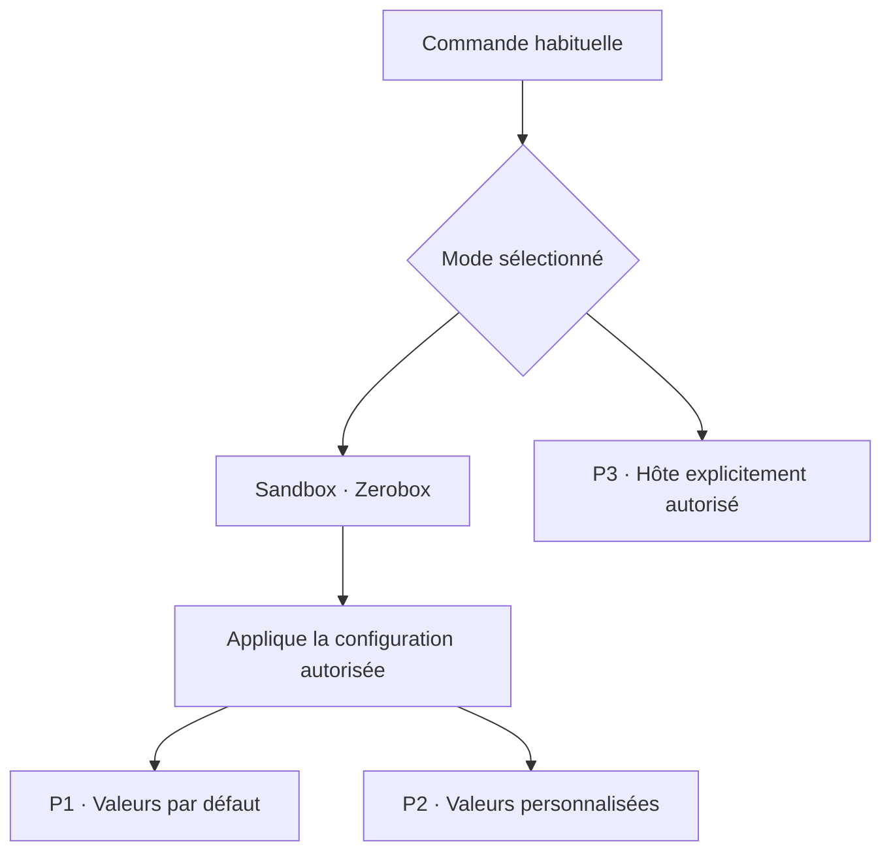
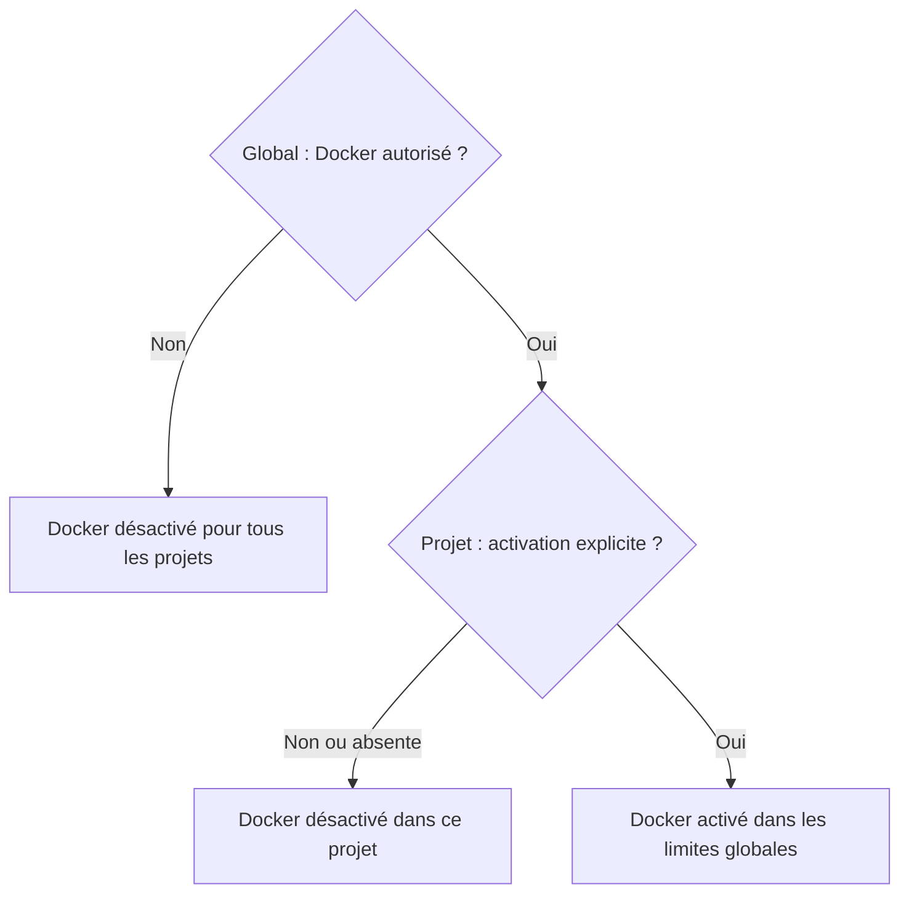

# Plan de correction architecturale du sandbox Pi

Statut d’exécution : candidat A1–A6 livré et qualifié sous WSL le 2026-09-11 après l’implémentation autorisée avec un worker principal GPT-5.6 Terra et un contrôleur chargé de l’orchestration. Consulte le [rapport de livraison](./2026-09-10-sandbox-generalisation-execution.md) pour les preuves et les limites. Garde l’activation personnelle séparée. UDP reste différé en A7.

Périmètre validé : deux modes d’exécution, sandbox configurable et hôte explicite. Conserve exactement deux emplacements de configuration active : `~/.pi/agent/sandbox.json` et `<projet>/.pi/sandbox.json`. Applique aussi la décision Docker validée : autorisation globale commune, activation explicite dans chaque projet, désactivation si le projet ne précise rien, sans registre global d’accords par projet. Q1 est validée : permets aussi le partage complet du `/tmp` hôte sur configuration explicite. Q3 est validée : cible Linux natif et WSL et distingue leur qualification. Retire Q2, qui demandait une liste d’outils prioritaires, et qualifie les mécanismes génériques avant de proposer des limites. Suis les preuves et les écarts restants dans `2026-09-10-sandbox-generalisation-execution.md`. Prépare l’activation personnelle séparément, sans l’exécuter.

Utilise **P1/P2/P3 pour les profils** et **D1–D12 pour les décisions d’architecture**. Les anciens repères D1/D2/D3 des profils deviennent P1/P2/P3 dans tout ce plan.

## Modes d’exécution et profils

Exécute les commandes habituelles avec une politique de ressources indépendante des produits installés. Propose exactement deux modes d’exécution : **sandbox** et **hôte**.

| Profil | Mode d’exécution | Signification |
| --- | --- | --- |
| **P1 — Sandbox par défaut** | Sandbox, avec Zerobox | Pars d’un réseau fermé, d’un `/tmp` privé et de lectures limitées au projet et au socle des outils. Permets de personnaliser ces valeurs. |
| **P2 — Sandbox personnalisé** | Sandbox, avec Zerobox | Applique la configuration locale autorisée : domaines, chemins et autres ressources précises prises en charge. Conserve toutes les restrictions non modifiées. |
| **P3 — Hôte explicite** | Hôte, avec le superviseur local | Exécute hors de Zerobox seulement après sélection explicite de ce mode et autorisation locale. |

Traite P1 et P2 comme deux descriptions de la configuration effective du même sandbox. **Ne demande pas d’activer P2 après avoir autorisé une ressource dans la configuration locale.** Déduis P2 si la politique effective diffère du socle, y compris pour une restriction supplémentaire. Déduis P1 lorsqu’elle retrouve le socle. N’utilise pas le libellé P1/P2 comme un verrou qui annule la configuration.



N’introduis pas de champs de configuration nommés `P1`, `P2` ou `P3`. Utilise ces références dans le plan et la documentation. Fais évoluer les anciens sélecteurs `isolated`/`integrated`/`host` lors de la migration décrite plus bas.

## Décisions d’architecture

- **D1 — Valeurs isolées par défaut.** Initialise une nouvelle installation avec le socle P1. Traite réseau fermé et `/tmp` privé comme des valeurs initiales. Préserve les ouvertures précises explicitement autorisées en P2.
- **D2 — Configuration effective.** Applique les modifications valides de la configuration locale faisant autorité sans second octroi ni sélection séparée de P2. Plafonne les demandes du dépôt par cette autorité.
- **D3 — Hôte explicite.** Réserve les besoins hôte et les ouvertures incompatibles avec le sandbox borné à P3. Ne change jamais de mode à la suite d’un échec ou d’une modification de ressource.
- **D4 — Commandes ordinaires.** Retire `hostCapability`, les trois adaptateurs et la pseudo-commande `editor`. Préserve la syntaxe du shell, les arguments et les contrôles de permissions. N’ajoute pas de registre de fournisseurs.
- **D5 — Frontière fonctionnelle.** Laisse les règles SFW, les gestionnaires de dépendances et les conventions Dev Services dans leurs outils et procédures. Ne réécris pas leurs commandes dans le sandbox.
- **D6 — Un nom, deux emplacements.** Centralise les réglages et autorisations globaux dans `~/.pi/agent/sandbox.json`. Place les overrides de chaque projet dans son propre `.pi/sandbox.json`. Après migration, retire `sandbox.global.json` et `sandbox.capabilities.json` des sources actives. Ne crée aucune section globale `projects` pour les overrides.
- **D7 — Docker autorisé globalement, activé par projet.** Fais décider au global si Docker est autorisé et quelles opérations sont permises. Exige une activation explicite dans le fichier du projet. Sans activation, garde Docker désactivé, même si le global l’autorise. Ne demande aucun accord supplémentaire par projet dans le global.
- **D8 — `/tmp` configurable.** Conserve `/tmp` privé par défaut et permets le partage complet du `/tmp` hôte dans P2 sur configuration explicite autorisée. Ne sélectionne pas P3 pour cette seule ouverture. Préserve les exclusions explicites et le `/tmp` privé de Think.
- **D9 — Linux et WSL, qualification par mécanismes.** Valide la première version sur Linux natif et WSL. Établis les possibilités du backend et les restrictions de Pi par ressources, sans liste de produits obligatoires. Ne déduis pas une impossibilité technique d’un refus de configuration existant.
- **D10 — Évolution générique du backend.** Réalise les évolutions configurables de Zerobox nécessaires aux mécanismes retenus dans le périmètre d’implémentation autorisé. Valide leur fonctionnement et leurs limites avant activation. Garde Zerobox indépendant des noms d’outils et des contrats Pi; expose les ressources à travers ses interfaces génériques.
- **D11 — Publication explicite des serveurs.** Garde les serveurs privés par défaut. Permets leur publication vers la machine hôte et, sur configuration distincte, vers le réseau local, avec adresse d’écoute et ports précis. Conserve le processus serveur dans Zerobox. N’assimile pas une publication de port à l’ouverture globale du réseau hôte.
- **D12 — Autorité des services accessibles par socket.** Permets l’accès explicitement configuré à un socket précis et accepte les fonctions que le service accorde à l’utilisateur connecté. N’exige pas de filtre des actions propre au protocole. Distingue la précision du chemin autorisé de l’étendue des pouvoirs du service. Conserve la politique Docker et son broker définis en D7.

Applique ces modes aux surfaces shell possédées par `bash-execution`. Ne présente pas cette évolution comme une isolation des outils natifs `read`, `write`, `edit`, des extensions ou des MCP. Conserve Think strict indépendamment de la configuration shell.

## Emplacements de configuration

```text
~/.pi/agent/sandbox.json
    Réglages par défaut, limites et autorisations globales, dont Docker

<projet>/.pi/sandbox.json
    Overrides de ce projet uniquement
```

Résous la configuration dans cet ordre : socle intégré → configuration globale → overrides du projet, sous les limites globales → accords temporaires de session explicitement autorisés. Garde les accords temporaires en mémoire. Ne crée aucun troisième fichier de configuration.

Rends le fichier projet facultatif : sans lui, utilise les réglages globaux ordinaires et garde Docker désactivé. Ne confonds pas l’autorisation globale Docker avec une valeur d’activation héritée. Résous les chemins relatifs du fichier projet depuis la racine canonique de ce projet. Conserve `~/…` pour les chemins relatifs au HOME et développe-les avant l’I/O. Garde les overrides dans les projets, sans les recopier dans le fichier global.

Conserve l’identité de machine et la protection de l’autorité globale. Calcule la portée projet depuis le fichier projet et sa racine canonique. Ne considère pas la présence d’un fichier versionné comme une autorisation de dépasser les limites globales. Sépare les règles Docker et shell dans les types internes du fichier global, sans séparer leur stockage.

Après migration, cesse de lire la clé `sandbox` des fichiers `settings.json`, `sandbox.global.json` et `sandbox.capabilities.json` comme configurations actives. Versionne le contenu du `~/.pi/agent/sandbox.json` conservé pour distinguer son ancien format du schéma consolidé. Préserve les autres réglages de Pi et les archives de migration. Ne présente pas une archive ou un schéma JSON comme un fichier supplémentaire à configurer.

Valide séparément le schéma global et le schéma projet selon l’emplacement réellement chargé. N’utilise pas une fusion générique qui permettrait au projet d’écraser les autorisations globales. Un champ réservé au global placé dans le projet doit produire une erreur explicite avant admission, et non être ignoré silencieusement. Protège le fichier global contre les modifications autonomes des outils et conserve les contrôles de chemins canoniques et d’alias.

## `/tmp` et plateformes validés

Conserve `tmpNamespace: "lease-private"` par défaut. Accepte `tmpNamespace: "host"` dans la configuration globale autorisée pour partager le `/tmp` hôte en P2. Permets au projet de conserver un `/tmp` privé sous ce plafond, sans élargissement autonome de son autorité. Ne transforme pas un fichier absent, un échec d’outil ou un chemin manquant en demande de partage.

Documente le partage complet du namespace `/tmp` avec ses exclusions explicites maintenues. Vérifie la lecture et l’écriture croisées hôte/shell avec des marqueurs de test et l’absence d’ouverture implicite du réseau, du reste du HOME ou du mode hôte. Garde Think en `lease-private`, quelle que soit la valeur shell.

Exécute la qualification sur Linux natif et WSL. Ne compte pas deux configurations sous WSL comme une validation Linux native. Si une plateforme manque dans l’environnement d’exécution, rapporte cette preuve comme manquante. L’interop Windows depuis WSL fait partie des mécanismes à examiner; un backend Windows natif ou macOS n’entre pas dans cette première version.

## Règle Docker validée



Distingue les deux champs du contrat cible : `docker.allowed` dans le global et `docker.enabled` dans le projet. Initialise chacun à `false` s’il est absent. Valide leur type booléen, sans conversion implicite. Réserve `docker.allowed` et les exceptions sensibles au schéma global; réserve l’activation `docker.enabled` au schéma projet. Une valeur à la mauvaise portée est une erreur de configuration.

Exemples minimaux des sélecteurs, à compléter par les limites d’opérations Docker du schéma :

```json
{"docker": {"allowed": true}}
```

Place l’autorisation ci-dessus dans `~/.pi/agent/sandbox.json`. Pour activer Docker dans un projet, place uniquement son choix dans `<projet>/.pi/sandbox.json` :

```json
{"docker": {"enabled": true}}
```

Autorise Docker globalement et conserve les contrôles du broker. Définis les cibles ordinaires et leurs opérations dans chaque projet, sans liste globale de cibles. Limite les opérations globalement si nécessaire et garde les exceptions sensibles exactes dans `docker.unsafeTargets` global. Une exception globale ne sélectionne aucune cible pour le projet.

| Cas | Autorisation globale | Activation projet | Résultat |
| --- | --- | --- | --- |
| **K1** | Absente ou `false` | Absente ou `false` | Désactivé. |
| **K2** | Absente ou `false` | `true` | Désactivé; indique que le global interdit Docker. |
| **K3** | `true` | Fichier projet absent, section Docker absente ou champ absent | Désactivé. |
| **K4** | `true` | `false` | Désactivé. |
| **K5** | `true` | `true` | Activé dans les limites globales et les restrictions du projet. |

Ne stocke aucune liste de projets Docker autorisés dans le global. Accepte qu’un projet, nouveau ou existant, puisse s’activer lui-même dans le plafond Docker que l’utilisateur a explicitement autorisé globalement. Ne demande pas d’inscription préalable de sa racine. Continue à utiliser sa racine canonique pour appliquer sa configuration, ses restrictions et sa provenance.

Calcule l’éligibilité Docker à chaque admission à partir de l’autorisation globale et de l’activation projet. Une désactivation globale ou projet retire l’accès aux nouvelles opérations, y compris si un accord temporaire existe. Conserve les permissions de commandes, le broker et l’interruption à expiration des opérations break-glass déjà admises. N’étends pas cette règle d’activation Docker à P3 : l’exécution hôte reste un choix explicite distinct.

## Effet des modifications de configuration

Distingue les sources par leur emplacement et leurs protections. Ne prétends pas reconnaître l’auteur humain d’une modification de fichier.

| Source | Rôle |
| --- | --- |
| `~/.pi/agent/sandbox.json` | Définit les valeurs par défaut et les autorisations globales de cette machine. Une édition valide de cette source vaut autorisation, sans second octroi par commande. |
| `<projet>/.pi/sandbox.json` | Surcharge les réglages pour ce projet, dans les limites globales. Ne crée aucun droit au-delà de ces limites à elle seule. |
| Accord temporaire de session | Applique uniquement les droits explicitement autorisés pour cette session. Ne les persiste pas par défaut. |

Fais évoluer le schéma global de `sandbox.json` en A2 pour réunir les réglages ordinaires, les autorisations shell et les autorisations Docker. Utilise `network.allowedDomains` dans les deux fichiers selon leur portée. Ne persiste pas une seconde liste équivalente `grants.domains`; lis cette ancienne forme uniquement pendant la migration. Ne remplace pas les anciens accords spécifiques à un projet par des accords globaux implicites.

Pour les domaines, utilise la liste locale autorisée si le dépôt ne précise rien. Si le dépôt précise une liste, applique son intersection avec l’autorité locale, puis les exclusions. Une liste explicite vide ferme cet accès. Applique le même principe aux ouvertures de chemins, avec leurs règles canoniques, sans effacer les ressources techniques nécessaires au socle.

| Exemple | Effet attendu |
| --- | --- |
| **C1 :** ajoute `github.com` à `network.allowedDomains` dans le `sandbox.json` global, sans restriction contraire du fichier projet. | Autorise cette destination dans Zerobox. Affiche P2 sans demander de changer de profil ni de recopier le domaine dans un autre fichier. |
| **C2 :** définis `network.allowedDomains` dans `<projet>/.pi/sandbox.json`. | Applique cet override uniquement à ce projet, dans la liste globalement autorisée. Si un domaine dépasse les limites globales, affiche la demande non accordée. Ne demande pas de recopier l’override dans une section `projects`. |
| **C3 :** retire un domaine du `sandbox.json` global. | Retire l’accès pour les nouvelles opérations. Ne restaure pas une valeur plus large par défaut. |
| **C4 :** ajoute un chemin précis autorisé en lecture. | Ouvre ce chemin en P2. Ne change ni le réseau ni les droits d’écriture. |
| **C5 :** demande une ressource indisponible ou une ouverture trop large pour P2. | Refuse explicitement cette configuration ou opération. Ne sélectionne pas P3. |
| **C6 :** sélectionne explicitement le mode hôte et dispose de son autorisation locale. | Utilise P3. Revenir au mode sandbox restaure la configuration autorisée, donc P1 ou P2. |

Valide et prends en compte les modifications externes avant l’admission d’une nouvelle opération. Si elles exigent de reconstruire le runtime, bloque les nouveaux appels jusqu’à sa disponibilité avec la bonne empreinte. Laisse finir les opérations déjà admises. En cas de fichier invalide, signale l’erreur et bloque les nouvelles admissions plutôt que de réutiliser silencieusement des droits obsolètes.

Conserve les contrôles de permissions sur les commandes dans les deux modes. L’autorisation d’un domaine ne vaut pas autorisation de toute commande.

## Preuves et limites de la préparation

Le checkout inspecté est `develop`, à `59b24f5`. Les modifications préexistantes correspondent au handoff. Aucun code, accord local, processus Pi ou service n’a été modifié pendant cette préparation.

Le fichier `/tmp/pi-sandbox-generalisation-handoff.md` était absent. Son contenu a été retrouvé dans l’événement `FileChange` de la session `01a08764-5478-77e1-8366-e54292fdbf23`, horodaté `2026-09-10T13:43:22.641Z`.

| Référence | Observation vérifiée dans le code | Conséquence |
| --- | --- | --- |
| F1 | `capabilities/policy.ts` calcule déjà les profils et les accords locaux. | Conserve ce propriétaire de décision. |
| F2 | `builtin-bash.ts` appelle `prepareHostIntegration`; les trois routes exécutent sur l’hôte. | L’ancien profil `integrated` ne satisfait pas la frontière P2 choisie. |
| F3 | `runtime/policies.ts`, `createShellPolicy`, transforme une liste de lectures vide en `["/"]`. | Corrige le socle de lecture et la signification de la configuration vide. |
| F4 | `BASH_SAFE_PATH_SEGMENTS` contient des chemins propres à plusieurs outils et installations. | Sépare la résolution locale du PATH des droits de lecture, sans catalogue de produits. |
| F5 | La configuration rejette `allowAllUnixSockets: true`; les interdictions fixes comprennent `/mnt/c`. | Classe ces refus comme restrictions actuelles de Pi. Examine séparément les possibilités réelles du backend avant de conclure sur l’IPC ou l’interop WSL. |
| F6 | Les tests existants couvrent identité, refus, supervision, révocation et drainage. | Préserve leurs assertions en changeant la frontière testée. |
| F7 | `resolveShellPolicy` vide les accords en `isolated` et utilise `allowedDomains` pour filtrer les accords préexistants. | Remplace ce verrou par la résolution de configuration puis la description P1/P2. |
| F8 | `createShellPolicy` traite `tmpNamespace: "host"`; `zerobox-backend.ts` omet alors `--private-tmp`. | Le partage `/tmp` est déjà représenté dans le chemin de compilation. Valide son intégration au nouveau modèle sans le classer comme exécution hôte. |

Les 624 réussites mentionnées dans le handoff sont une preuve historique de l’ancienne solution. Aucun test n’a été exécuté pendant cette planification. La compatibilité réelle des outils installés sous le futur P2 reste à mesurer.

## Architecture cible

Fais suivre à chaque appel le parcours suivant : permissions existantes → résolution de l’autorité machine/projet/session → politique effective → admission avec empreinte de politique → Zerobox pour P1/P2 ou superviseur hôte pour P3 → résultat et provenance.

Fais converger les lecteurs et les écritures shell/Docker sur le même magasin global validé. Conserve `capabilities/authority.ts` comme point d’entrée de persistance shell, `capabilities/policy.ts` pour la décision et `capabilities/runtime.ts` pour la publication et les opérations admises. Garde `builtin-bash.ts` comme consommateur de cette décision. Ne distribue pas la connaissance des accords dans les prompts ou les outils appelants.

### Socle P1 personnalisable

Définis les valeurs par défaut du socle Linux/WSL de ressources système en lecture seule, incluant les exécutables système, leurs bibliothèques et les fichiers système effectivement nécessaires aux essais. Décris ce socle explicitement et teste-le avec le backend installé. N’accorde ni `/`, ni tout le HOME, ni tout `/etc` par commodité.

Ajoute le projet et les chemins techniques de la lease nécessaires au runtime. Conserve les exclusions explicites et les magasins d’autorité protégés. Préserve le comportement distinct de Think.

Pour les outils installés hors du socle système ou du projet, utilise les accords de chemins P2. Par exemple, un runtime installé dans un dossier utilisateur peut demander la lecture de sa distribution et l’écriture d’un cache précis. N’infère aucun droit à partir d’un nom de produit, du PATH ou de la présence d’un exécutable.

Résous un PATH système par défaut. Permets un PATH local configuré, lié à la machine et au projet, sans lui conférer de droits filesystem. Ne lance pas un shell de connexion pour découvrir ce PATH. Préserve HOME comme valeur de chemin si nécessaire, sans rendre son contenu lisible pour autant.

### Ressources P2

| Ressource | Traitement proposé | Limite |
| --- | --- | --- |
| Fichier ou dossier | Accord canonique de lecture ou d’écriture, puis intersection avec les restrictions du projet. | Un lien ne doit pas élargir la racine accordée. |
| Destination réseau | Réutilise les règles réseau et le transport réellement pris en charge. | Une règle de destination ne garantit pas tous les protocoles. |
| Cache ou configuration locale | Accorde les chemins nécessaires; conserve la commande et les options d’origine. | N’ajoute ni montage global du HOME ni adaptation par gestionnaire. |
| Fichier temporaire à partager | Permets un emplacement précisément accordé ou le partage complet du `/tmp` hôte explicitement configuré. | Reste en P2, préserve les exclusions et garde Think privé. N’active pas le partage implicitement. |
| Socket Unix local | Qualifie d’abord l’accès à un socket de test précis et les droits du service derrière ce socket. | Ne confonds pas précision du chemin et étroitesse de l’autorité du service. |
| IPC de session, affichage et interop Windows depuis WSL | Identifie les ressources et mécanismes requis, puis qualifie ce qui peut être exposé génériquement en P2. | Ne classe pas une catégorie de produits directement en P3. Si l’exécution exige effectivement l’hôte ou une ouverture non autorisée, présente P3 comme choix explicite. |

Pour un socket ou protocole non démontré avec le backend existant, indique « non qualifié » pendant la conception. À l’exécution, bloque une demande que le backend actif ne sait pas appliquer et explique la limitation précise. N’invente pas un adaptateur de produit. Une éventuelle extension du backend doit faire l’objet d’un petit contrat de ressource générique, avec ses propres tests, avant d’être promise dans P2.

Conserve le broker Docker existant. Place l’autorisation Docker, les limites communes d’opérations et les exceptions sensibles exactes dans le `sandbox.json` global. Place les cibles et opérations choisies dans le `.pi/sandbox.json` de chaque projet. N’impose aucun registre global de cibles ordinaires. Ne convertis pas un accord Docker en accès brut au socket.

### Publication des serveurs validée en Q5

Distingue trois directions : connexions sortantes du sandbox, connexions internes entre processus sandboxés et connexions entrantes depuis l’hôte ou le réseau local. Ne réutilise pas `allowedDomains` comme autorisation de publier un serveur.

Décris chaque publication par son protocole, son adresse et port d’écoute côté hôte, et la destination côté sandbox. Exige une configuration distincte pour une publication sur le réseau local. Le démarrage du serveur seul ne crée aucun port hôte publié. Qualifie les transports via A1/A1b; ne présume pas que la publication TCP implémente aussi UDP.

Conçois un transport générique de publication avec fermeture de l’écoute au retrait de l’autorisation, refus des nouvelles connexions et drainage borné des connexions admises selon les contrôles existants. Attache ses ressources au cycle de vie du runtime et conserve timeout et annulation. Si un port hôte est occupé, rapporte le conflit; ne tue pas son propriétaire et ne publie pas silencieusement sur un autre port ou une autre interface.

Vérifie par des fixtures que le serveur reste isolé, que rien n’est publié par défaut, qu’un port loopback est accessible depuis l’hôte sans être publié sur le réseau local, et qu’une publication réseau local distincte respecte son adresse et ses ports. Distingue tests d’adresse locale et preuve de connexion depuis un pair contrôlé du réseau.

### Accès aux services par socket validé en Q6

Autorise uniquement les sockets explicitement configurés. Ne transforme pas une autorisation de socket en ouverture générale des sockets Unix. Qualifie la résolution du chemin, les alias, les remplacements de socket et l’identité présentée au service. Affiche la ressource accordée sans prétendre filtrer les actions du protocole ou annuler leurs effets externes.

Teste avec un service jetable l’accès au socket autorisé, le refus d’un autre socket et le maintien des permissions du service. Vérifie le retrait de l’accès pour les nouvelles connexions et le traitement borné des connexions déjà admises. Ne convertis pas l’autorisation Docker via broker en accès brut au daemon.

### Inventaire technique remplaçant Q2

Consulte l’[inventaire de limites vérifié sur la provenance du binaire installé](./2026-09-10-sandbox-generalisation-limites.md). La lecture du backend correspondant confirme que les sockets Unix nommés et l’UDP sont aussi bloqués par ses filtres en mode réseau géré, au-delà du seul validateur Pi. La question Q4 est validée : inclus les évolutions génériques configurables du backend dans le plan, avec validation avant activation. La question Q5 est validée : publication possible vers l’hôte et, séparément, le réseau local avec adresse et ports explicites. Q6 est validée : accès par socket précis dans les permissions du service, sans filtrage propre au protocole, selon D12.

Ne demande pas à l’utilisateur de sélectionner des produits pour déterminer ce que le sandbox pourra supporter. Qualifie d’abord les mécanismes ci-dessous avec de petites fixtures. Les outils réels pourront compléter cette preuve de compatibilité, sans devenir des adaptateurs de production.

| Mécanisme | État observé par lecture du code | Qualification requise en A1 |
| --- | --- | --- |
| **T1 — Fichiers et montages** | Lectures/écritures et exclusions sont compilées vers Zerobox. | Socle minimal, chemins supplémentaires, liens, permissions et comportements Linux/WSL. |
| **T2 — Temporaire** | Les namespaces privé et hôte sont représentés dans la politique et les arguments du backend. | Visibilité croisée, exclusions maintenues, changement de configuration et séparation Think. |
| **T3 — Environnement et exécutables** | Variables filtrées, PATH et HOME sont préparés par Pi. | Bibliothèques, exécutable hors socle, environnement nécessaire et absence de droits conférés par le PATH. |
| **T4 — Réseau** | Règles `allow_net`/`allow_host_net` et `--allow-local-binding` sont transmises. | Protocoles exacts, DNS, ports, direction des connexions, loopback hôte et écoute. Un flag ne prouve pas tous ces parcours. |
| **T5 — IPC et affichage** | L’accès global aux sockets Unix est refusé par la configuration actuelle. | Sockets filesystem/abstraits, bus, ressources d’affichage et autorité du service exposé. Distingue restriction Pi, limite backend et limite système. |
| **T6 — Processus et interop WSL** | La supervision est présente; `/mnt/c` est interdit par la politique actuelle. | Processus enfants, sessions/TTY, durée de vie, ponts WSL et ressources Windows. Ne confonds pas accès fichier et lancement de processus Windows. |

Pour chaque mécanisme, rapporte : support actuel, modification générique envisageable, restriction volontaire ou impossibilité démontrée, avec sa preuve et l’ouverture requise. N’assimile pas « non testé » à « impossible ». Soumets ensuite à l’utilisateur les compromis d’ouverture qui nécessitent réellement son choix; ne lui demande pas de deviner la faisabilité.

### Deux configurations de machine

Ces parcours sont des cibles de validation, pas des résultats déjà obtenus. Les noms ci-dessous restent des exemples dans la documentation et les essais locaux.

| Usage | Machine A | Machine B | Ce que connaît le sandbox |
| --- | --- | --- | --- |
| Shell/projet | `./bin/check` | `./bin/check` | Projet, shell, socle système. Aucun nom d’outil. |
| Dépendances | Commande SFW et gestionnaire déjà prescrits sur A | Commande SFW et autre gestionnaire déjà prescrits sur B | Chemins du runtime/cache et destinations autorisées. Aucun ajout automatique de wrapper ou d’option. |
| Service de développement | `./bin/dev run ...` | Commande habituelle du service présent sur B | Ressources et protocole démontré; P3 si l’opération nécessite l’hôte. |
| Éditeur | `zed fichier` | `code fichier` ou autre commande locale | P2 seulement si les ressources nécessaires sont démontrées et bornées; sinon P3 explicite. |

Exécute aussi exactement `./bin/check` dans deux fixtures dont les exécutables, caches et racines locales diffèrent. Prouve que seule la configuration change et que le sandbox n’a pas besoin d’un nouvel identifiant ou adaptateur.

## Migration proposée

Versionne le schéma global consolidé et conserve un lecteur historique séparé. Vérifie les versions déjà utilisées par Docker et les capacités avant de choisir le numéro du nouveau format. Retire les types spécialisés du contrat actif, tout en conservant la capacité de lire et d’expliquer l’ancien format pour migrer.

Convertis les anciens sélecteurs `isolated` et `integrated` vers le mode sandbox. Calcule ensuite P1/P2 depuis les ressources explicitement retenues. Ne réactive pas automatiquement des accords auparavant neutralisés par `isolated`. Convertis `host` vers le mode hôte uniquement si sa sélection et son autorisation sont confirmées. Traduis une restriction de dépôt `isolated` en restriction explicite au socle, visible dans le diagnostic, et `integrated` en demande de mode sandbox. Ne laisse jamais le dépôt sélectionner le mode hôte de lui-même.

1. **M1 — Prévisualisation.** Lis les anciennes sources sans les écrire : sections sandbox de `settings.json`, anciens `sandbox.json`, autorité Docker `sandbox.global.json` et `sandbox.capabilities.json`. Affiche leur provenance, les conflits, les accords génériques conservables, les trois accords spécialisés retirés et les ouvertures incompatibles avec P2. Montre les deux destinations finales.
2. **M2 — Absence de conversion implicite.** Ne transforme jamais `editor`, `dependencies` ou `dev-services` en droit `host`, en commande hôte autorisée ou en chemin automatiquement accordé. Ne convertis pas non plus la lecture implicite de `/` en accord explicite.
3. **M3 — Portée des réglages.** Migre les réglages globaux vers `~/.pi/agent/sandbox.json` et les overrides vers `.pi/sandbox.json` de chaque projet. Ne crée aucune section globale `projects`. Pour Docker, garde les cibles et opérations historiques dans les fichiers de leurs projets. Place uniquement l’autorisation générale, les limites communes et les exceptions sensibles explicitement retenues dans le global. Ne transforme pas les accords par projet en registre global de cibles. Sans autorisation globale explicite, garde Docker désactivé. Pour les autres droits limités à un projet, ne les généralise pas implicitement; garde les autorisations non représentables inactives et explique leur portée. Ne modifie pas les autres projets sans leur migration.
4. **M4 — Publication contrôlée.** Archive les sources précédentes, prépare et valide les destinations, puis remplace chaque fichier atomiquement. Une mise à jour de deux fichiers n’est pas atomique : bloque les admissions du projet pendant la migration et détecte toute migration interrompue avant activation. Conserve identité machine, protection du fichier global et sérialisation commune des écritures shell/Docker. Une annulation avant publication ne modifie rien; un échec partiel laisse l’exécution bloquée et un diagnostic de reprise.
5. **M5 — Transition.** Bloque les nouvelles opérations du projet tant que sa migration est requise. Laisse finir les opérations déjà admises. Préserve timeout, annulation et le comportement interruptif propre au break-glass Docker.

Garde la provenance historique lisible pour les anciens résultats, sans accepter le champ spécialisé comme demande d’exécution actuelle. Un ancien appel avec `hostCapability` doit produire un diagnostic explicite avant tout lancement, même si la validation du schéma accepte habituellement des propriétés supplémentaires.

## Lots d’implémentation

Exécute les lots localement après validation du plan. Ne lance ni revue de sécurité ni sous-agent de sécurité. Préserve les modifications utilisateur, les services et les dépendances existantes.

Applique Q7 validée : livre A1–A6, y compris A1b, sans support UDP applicatif. Réserve ce support au lot ultérieur A7. Distingue les protocoles dans le modèle de ressources dès la première livraison et refuse explicitement une demande UDP non prise en charge, sans fallback hôte ni conversion silencieuse en TCP. Ne bloque pas la livraison initiale sur la réalisation d’A7.

### A1 — Qualifier le socle et les ressources du backend

**Fichiers :** `agent/extensions/sandbox/runtime/policies.test.ts`, `runtime/zerobox-backend.test.ts`; nouveau `agent/extensions/sandbox/runtime/shell-baseline.integration.test.ts`.

**Interface consommée :** `createBashPolicy` et le backend déjà utilisés par les tests réels. **Livrable :** liste minimale démontrée de ressources système, et matrice des transports compatibles.

- Vérifie le chemin, la version et la provenance du binaire réellement chargé. Ne déduis pas ce chemin de l’ancien handoff.
- Construis des fixtures jetables : projet, fichier voisin, configuration utilisateur, cache extérieur et endpoint local contrôlé. Place les projets de test réel hors du `/tmp` hôte masqué par le backend.
- Ajoute dans `policies.test.ts` le premier RED, avec ses fixtures `cwd` et `lease` existantes :

```ts
it("does not turn an empty read configuration into host root access", () => {
    const config = validatePiSandboxConfig({});
    const policy = createBashPolicy({ cwd, lease, config, hostEnv: {} });
    expect(policy.filesystem.allowRead).not.toContain("/");
    expect(policy.filesystem.allowRead).toContain(cwd);
});
```

- Confirme l’échec voulu sur `["/"]`. Exécute ensuite les essais de politique candidate au travers du backend existant, sans élargir les droits des sessions réelles.
- Vérifie shell, chargement d’une bibliothèque dynamique, lecture du projet, écriture du projet et cache privé. Vérifie le refus de lecture du fichier voisin et de la configuration utilisateur.
- Qualifie T1–T6 sur Linux natif et WSL. Pour l’interop WSL et les sockets, distingue les refus du validateur Pi des limites effectives du backend et du système. Un échec de setup doit rester distinct du code de sortie de la commande.
- Produis la matrice de possibilités avant toute question de priorité par outil. Propose des évolutions génériques lorsque la limite se situe dans l’adaptation Pi; ne limite pas la portée aux seuls mécanismes déjà exposés.

**Commande ciblée :** depuis `~/.pi/agent`, `bun test --isolate extensions/sandbox/runtime/policies.test.ts -t 'empty read configuration'`.

**Gate :** arrête la qualification si le socle exige un accès global non prévu. Documente le besoin précis avant de changer le socle P1 défini par D1. Ne traite pas ce besoin empirique comme résolu par le présent plan.

### A1b — Concevoir et qualifier les évolutions génériques de Zerobox

**Périmètre :** modules du fork possédant le mécanisme identifié par A1, interfaces Rust/CLI/profils et tests correspondants. Utilise le dépôt indépendant sous `~/projects/shared-services/sandboxes/`. Identifie d’abord le checkout source correspondant au binaire installé et préserve les modifications externes déjà présentes.

- Établis pour chaque mécanisme le contrat de ressource demandé, la valeur fermée par défaut, la validation des paramètres, le cycle de vie et le diagnostic d’indisponibilité. Intègre la publication Q5 selon D11 et l’accès aux sockets Q6 selon D12, sans supposer le support des transports non qualifiés. Attends le choix utilisateur pour les frontières encore ouvertes.
- Commence par un test RED via l’interface publique réelle du backend. Utilise un service de fixture contrôlé, sans contact avec un service personnel. Vérifie que l’échec provient du mécanisme manquant, puis implémente l’ouverture générique minimale.
- Couvre le succès explicitement configuré, le refus d’une ressource voisine non autorisée, l’annulation, le nettoyage, la concurrence, les nouvelles admissions après retrait et le maintien de l’isolation restante.
- Si le code appartient aux crates régénérées, modifie les patches et exécute `./scripts/sync.sh`. Ne modifie pas directement `upstream/`. Arrête sur un hunk rejeté; conserve les preuves de replay et des tests effectivement exécutés.
- Valide Linux natif et WSL avant de déclarer ce support acquis. Identifie les plateformes non exécutées. Ne remplace pas un test backend par un mock Pi.
- Prépare le binaire, sa provenance et sa procédure de retour arrière; intègre ensuite le contrat générique dans Pi. Ne copie ni protocole Pi ni branche par produit dans Zerobox. Respecte les contrôles de dépendances si une modification de dépendances devient nécessaire.
- Garde l’activation personnelle séparée des tests du binaire candidat. Aucune ouverture nouvelle n’est active par simple installation de la version.

**Gate :** contrat générique documenté, tests réels pertinents exécutés, patches rejouables et binaire candidat identifié. N’affirme pas le support d’une capacité sur la seule base de son ajout au schéma Pi.

### A2 — Consolider les deux fichiers, appliquer les overrides et migrer

**Fichiers :** `capabilities/authority.ts`, `capabilities/policy.ts`, `capabilities/commands.ts`, `runtime/docker-policy.ts`, `runtime/docker-policy.test.ts`, `runtime/contracts.ts`, `sandbox/index.ts`, `capabilities/protection.ts`, `runtime/policies.ts`, `docs/sandbox.global.schema.json` et leurs tests. Crée les schémas cibles `docs/sandbox.schema.json` et `docs/sandbox.project.schema.json`; réserve l’ancien schéma global à la migration. Crée `capabilities/legacy-authority.ts` et `capabilities/migration.test.ts`. Les schémas décrivent les deux portées; ils ne sont pas des fichiers de configuration à remplir.

**Interfaces :** adapte les points d’entrée actuels `readCapabilityAuthority`, `saveProjectCapabilities`, `resolveShellPolicy`, `resolveDockerPolicy` et `createCapabilityCommands` aux deux sources. Retire les responsabilités d’enregistrement d’accords Docker par projet de la persistance globale. Fais lire et écrire les activations et overrides par les commandes dans le fichier du projet. Fais porter la sélection sur le mode `sandbox`/`host` et déduis séparément le profil descriptif par défaut/personnalisé/hôte. Retire la sélection `isolated`/`integrated` du contrat actif et conserve sa lecture uniquement pour migration. Adapte la provenance et les consommateurs en A4. Change les types qu’elles possèdent de façon cohérente. Réserve `legacy-authority.ts` à la lecture et à la prévisualisation du format historique.

- Écris le RED au point public de la commande de migration : charge les anciens fichiers contenant un accord spécialisé, un accord réseau, une autorisation Docker et un override de projet. Confirme la conservation des droits compatibles, puis relis les deux fichiers canoniques réellement écrits.
- Assert : schémas global/projet valides, aucun accord spécialisé actif, aucun droit hôte créé, plafond Docker égal à celui explicitement retenu, activation stockée uniquement dans le projet, destination réseau inchangée et archives égales aux octets originaux. Vérifie l’absence de fichier actif `sandbox.capabilities.json` ou `sandbox.global.json`, de section `projects` et de registre Docker global par racine.
- Ajoute annulation sans écriture, autorité d’une autre machine, projet différent non migré, grant temporaire de session et révocation.
- Écris un RED de résolution publique : édite le `sandbox.json` global avec `network.allowedDomains: ["github.com"]`, relis-le via le point d’entrée global, puis appelle `resolveShellPolicy`. Sans fichier projet, assert : mode sandbox, profil personnalisé, destination effective `github.com`, sans autre fichier à éditer ni sélection d’`integrated`.
- Ajoute un `.pi/sandbox.json` qui réduit la liste autorisée dans un projet et vérifie que le projet voisin conserve les réglages globaux. Teste les chemins relatifs à chaque racine, les champs hérités, les listes vides, les exclusions prioritaires et l’absence de section globale `projects`.
- Vérifie que les commandes de réglage global shell et Docker écrivent dans le même fichier global sans écraser leurs sections respectives, y compris en cas de mutations concurrentes. Vérifie que l’activation Docker du projet modifie seulement son `.pi/sandbox.json`. Conserve les protections des fichiers et l’identité machine.
- Ajoute des RED via le vrai `resolveDockerPolicy` pour K1–K5 : aucune recherche d’accord par racine, global autorisé avec projet absent toujours désactivé, puis activation de deux projets distincts sans écriture globale. Vérifie que le plafond global interdit toute opération supplémentaire demandée par le projet.
- Teste `docker.allowed` présent dans le projet, `docker.enabled` présent dans le global, un type non booléen et une exception sensible de projet : chacun produit une erreur de configuration avant lancement. Teste que les commandes ou fichiers projet ne permettent jamais d’écrire dans le fichier global protégé.
- Couvre les conflits entre sources historiques et une interruption entre les deux publications. Teste que les cibles Docker historiques restent propres à leurs projets et leurs exceptions sensibles ne deviennent jamais globales sans autorisation explicite, et qu’une annulation ne crée aucune activation. Vérifie qu’après migration les anciennes sources ne modifient plus la politique active.
- Couvre C1–C6 : liste absente, liste vide, intersection avec le dépôt, exclusion prioritaire, retrait, édition invalide et absence de changement implicite vers l’hôte. Vérifie qu’une restriction personnalisée produit aussi P2 et qu’un retour effectif au socle produit P1.
- Implémente M1–M5 et cette résolution, puis exécute `bun test --isolate extensions/sandbox/capabilities/authority.test.ts extensions/sandbox/capabilities/commands.test.ts extensions/sandbox/capabilities/migration.test.ts extensions/sandbox/runtime/docker-policy.test.ts`.

**Gate :** seuls `~/.pi/agent/sandbox.json` et le `.pi/sandbox.json` du projet sont des sources actives. Docker reste désactivé sans activation projet. Aucune conversion ne produit plus de droits que ceux explicitement retenus. Ne migre pas les fichiers personnels pendant les tests.

### A3 — Appliquer le socle de lecture et le PATH générique

**Fichiers :** `runtime/policies.ts`, `runtime/policies.test.ts`, `capabilities/policy.ts`, `capabilities/authority.ts`, `sandbox/index.ts`; nouveaux `runtime/shell-baseline.ts` et `runtime/shell-baseline.test.ts`.

**Responsabilités :** centralise dans `shell-baseline.ts` le socle Linux/WSL qualifié en A1. Garde la composition des accords et des préférences dans `resolveShellPolicy`. Conserve les types réels de `runtime/contracts.ts`.

- Fais passer le RED A1 en retirant le fallback `["/"]`. Compose socle système, projet et chemins techniques de lease; applique les exclusions existantes.
- Distingue explicitement une configuration absente, une liste vide et une préférence restrictive. Ne laisse jamais une intersection vide réactiver un accès plus large.
- Remplace la liste de chemins par produit du PATH par le socle système et une préférence locale générique. Persiste les chemins utilisateur sous `~/…`, puis développe-les au moment de l’I/O.
- Ajoute deux fixtures de machine avec des PATH différents. Assert : aucune configuration de la première n’accorde de lecture ou d’exécution supplémentaire sur la seconde.
- Ajoute au test réel la commande ordinaire `./bin/check`, l’accès refusé au voisin et l’accès P2 à un seul cache extérieur.
- Ajoute les tests de `tmpNamespace` privé par défaut et hôte explicitement autorisé : visibilité des marqueurs hôte, écritures visibles depuis l’hôte, exclusions préservées, possibilité de restriction privée par projet et refus d’élévation non autorisée. Assert : P2/Zerobox, droits réseau inchangés et Think toujours privé.
- Exécute `bun test --isolate extensions/sandbox/runtime/policies.test.ts extensions/sandbox/runtime/shell-baseline.test.ts extensions/sandbox/runtime/shell-baseline.integration.test.ts extensions/sandbox/capabilities/authority.test.ts`.

**Gate :** shell système fonctionnel, lectures hôte non accordées refusées, aucun nom de produit requis pour configurer un nouveau chemin. Conserve Think strict et ses tests existants.

### A4 — Supprimer les routes hôte spécialisées dans tout le contrat

**Fichiers :** `bash-execution/builtin-bash.ts`, `safe-bash/index.ts`, `safe-bash/description.ts`, `_shared/command-execution/{exec,core}.ts`, `_shared/sandbox-runtime/index.ts`, `_shared/execution-provenance/{types,index}.ts`, `sandbox/capabilities/{runtime,commands,authority,policy}.ts`, `sandbox/index.ts`.

**Retrait :** supprime `capabilities/adapters.ts` après transfert des assertions fonctionnelles utiles de `adapters.test.ts`. Ne déplace pas les trois branches vers un autre registre.

**Interface conservée :** `resolveBashOperations(localSupervisor, options)` choisit le backend uniquement depuis le mode effectif autorisé. Utilise la même branche Zerobox pour P1/P2. Retire `hostCapability` des options actives et des schémas exposés. Mets à jour les types partagés, l’affichage et la provenance pour distinguer mode d’exécution et profil descriptif. Garde la lecture des anciennes valeurs uniquement pour les résultats historiques.

- Écris le RED dans `bash-execution/capabilities.integration.test.ts` via `createTestSession` : un ancien appel contenant `hostCapability` échoue avec un diagnostic de migration et aucun marqueur de processus n’est créé.
- Vérifie aussi le contrat importé depuis `_shared/command-execution/exec.ts` :

```ts
import { bashWithStdinSchema } from "../_shared/command-execution/exec.ts";

test("ordinary shell schema contains no product selector", () => {
    expect(bashWithStdinSchema.properties).not.toHaveProperty("hostCapability");
});
```

- Conserve une détection de l’ancien champ à la frontière d’entrée non fiable, sans le réintroduire dans le schéma LLM. Utilise la même validation pour les surfaces publiques concernées.
- Remplace les tests de succès des adaptateurs par des commandes littérales et composées ordinaires, identiques à l’entrée et à l’exécution. Préserve les réécritures utilisateur déjà établies, sans ajouter de réécriture d’intégration.
- Assert : P2 reste `sandboxed`/`zerobox`, P3 est `unsandboxed`/`host`, moteur absent ou en erreur en P1/P2 ne lance jamais le superviseur local.
- Exécute `bun test --isolate extensions/bash-execution/capability-routing.test.ts extensions/bash-execution/capabilities.integration.test.ts extensions/_shared/command-execution/exec.test.ts extensions/_shared/execution-provenance/index.test.ts`.

**Gate :** aucun chemin d’exécution actif ne sélectionne un backend à partir de `editor`, `dependencies` ou `dev-services`. Limite les mentions historiques au lecteur de migration, aux anciens résultats et à la documentation historique.

### A5 — Préserver les permissions et la durée de vie des opérations

**Fichiers :** `bash-execution/capability-routing.test.ts`, `capabilities.integration.test.ts`, `provenance.integration.test.ts`, `sandbox/capabilities/commands.test.ts`, tests existants de `_shared/sandbox-runtime/` et du cycle de vie sandbox.

**Interfaces :** conserve `publishShellRuntime`, `requireShellPolicy`, `trackShellOperation` et les registres `globalThis`/`Symbol.for`. Retire seulement leur dépendance aux identifiants spécialisés.

- Avant toute modification de comportement de cycle de vie, établis une couverture verte de ses invariants actuels. Pour un nouveau comportement, confirme d’abord un RED au travers du vrai module.
- Lance une opération P2 contrôlée, révoque son ouverture et tente une seconde opération. Assert : seconde refusée, première termine, ancienne lease libérée après drainage.
- Vérifie timeout et annulation explicite en P2 et P3, changement de mode et de configuration, erreur de préparation, code de sortie non nul et état de provenance inconnu faute de preuve.
- Répète la révocation en éditant directement le fichier local d’autorité, sans commande `/sandbox`. Assert : relecture avant admission, ancienne empreinte refusée, droits retirés effectifs après reconstruction et absence de passage hôte. Teste aussi le blocage sur JSON invalide.
- Exécute via le vrai runtime Pi les cas Docker global interdit/projet activé et global autorisé/projet non configuré : aucune opération Docker ne démarre. Puis active le projet dans son fichier et vérifie une opération autorisée par le broker, sans enregistrement de ce projet dans le global. Vérifie la désactivation par édition globale et par édition projet avant la prochaine admission.
- Exécute via le vrai runtime Pi les refus de permissions et les restrictions de dépôt/session. Vérifie qu’aucun processus ne démarre en cas de refus.
- Exécute les commandes de fixture avec des arguments ressemblant à des noms de gestionnaires, des pipelines et des scripts projet. Vérifie l’absence d’ajout automatique de SFW, `--ignore-scripts` ou `--path` par le sandbox.
- Conserve la procédure `dependency-installation` pour toute véritable opération de dépendances. Ne retire pas un contrôle global de permissions pour faire passer ces tests.

**Commande ciblée :** `bun test --isolate extensions/bash-execution/capability-routing.test.ts extensions/bash-execution/capabilities.integration.test.ts extensions/bash-execution/provenance.integration.test.ts extensions/sandbox/capabilities/commands.test.ts`.

### A6 — Documenter, valider et préparer l’activation

**Fichiers :** `agent/extensions/sandbox/docs/configuration.md`, `agent/extensions/sandbox/docs/docker-authority.md`, `agent/extensions/sandbox/README.md`, `agent/extensions/sandbox/docs/shell-capabilities.md`, `docs/brainstorming/2026-09-09-sandbox-isolation-and-local-capabilities-design.md`, `docs/implementation/2026-09-10-sandbox-local-capabilities.md`, `docs/reviews/2026-09-10-sandbox-local-capabilities-review.md`, `docs/evaluations/sandbox-local-capabilities.md`.

- Marque l’ancienne orientation comme remplacée. Conserve les anciens résultats comme preuves datées, sans les attribuer à la nouvelle architecture.
- Documente le même nom `sandbox.json` aux deux emplacements et leur priorité, avec un exemple d’override situé dans le projet et aucun regroupement global des projets. Inclus D7, le schéma Docker et K1–K5 : global = autorisation et plafond, projet = activation volontaire, absence = désactivé. Explique que le projet peut activer les capacités globalement autorisées sans accord individuel et que les champs réservés au global sont refusés dans le projet. Documente séparément les deux modes, les profils P1/P2/P3 et les décisions D1–D12. Inclus le schéma et les exemples C1–C6 d’édition de configuration, le socle réellement qualifié, les ressources indisponibles, les commandes ordinaires et la migration. Remplace les évaluations qui attendent un adaptateur ou la pseudo-commande `editor`.
- Formate une seule fois les fichiers TypeScript modifiés avec `bun run fmt:files` et leur liste exacte. Utilise un contrôle lint limité à cette liste. Le script actuel `lint` impose `oxlint .`; utilise le binaire local uniquement si aucun script ciblé n’est disponible.
- Exécute les deux typechecks existants : `bun run typecheck` et `./node_modules/.bin/tsc --noEmit -p tsconfig.sandbox.json` depuis `~/.pi/agent`. Justification du contrôle transversal : modification des contrats partagés entre le shell, le runtime sandbox et la provenance.
- Exécute une seule fois la suite de frontière ci-dessous après stabilisation, puis uniquement les contrôles invalidés par un changement ultérieur :

```sh
bun --cwd=~/.pi/agent test --isolate extensions/sandbox/ extensions/bash-execution/ \
  extensions/_shared/sandbox-runtime/ extensions/_shared/command-execution/ \
  extensions/_shared/execution-provenance/
```

- Exécute les essais réels génériques A1/A3 avec le binaire identifié sur Linux natif et WSL. Distingue deux configurations simulées, deux environnements système et deux machines physiques. Une preuve WSL seule ne valide pas Linux natif; rapporte toute plateforme non exécutée.
- Lance un Pi neuf avec un répertoire d’agent et une autorité de test isolés; vérifie le package résolu, le schéma public et un parcours P1, P2 et P3. Ne redémarre pas la session personnelle pour ce smoke.
- Prépare séparément l’activation personnelle : archive et prévisualisation des accords, sortie des opérations admises, redémarrage complet et vérification après activation. Ne considère pas `/reload` comme une preuve de remplacement des propriétaires et schémas.
- Pour le rollback, restaure ensemble la version de code et son format d’autorité uniquement sur choix explicite. Ne restaure jamais automatiquement les anciennes ouvertures ni les modifications utilisateur sans rapport.

### A7 — Support UDP ciblé, lot ultérieur validé en Q7

Conçois puis qualifie le transport UDP générique de Zerobox après la première livraison. Définis les destinations et ports autorisés, le traitement des réponses, l’expiration des échanges et la révocation. Intègre le support dans les deux emplacements `sandbox.json` existants, sans nouveau fichier ni nouveau profil.

Commence par un test RED via l’interface publique réelle. Vérifie les échanges autorisés, le refus des destinations ou ports voisins et le nettoyage sur Linux natif et WSL. Valide avant activation. Ne déduis pas de ce lot le support du multicast, de la découverte réseau, des sockets bruts ou de la publication UDP entrante : qualifie et définis séparément ces extensions avant de les promettre.

## Alternatives examinées

| Référence | Approche | Décision et compromis |
| --- | --- | --- |
| O1 | Composition de ressources dans les modules actuels | Retenue comme proposition d’implémentation : conserve l’autorité et la supervision, retire la spécialisation. La compatibilité dépend de ressources réellement prises en charge. |
| O2 | Registre de fournisseurs par outil | Écarté par l’intention clarifiée du handoff : exige encore une intégration par produit. |
| O3 | Partage global implicite de la session hôte en P2 | Écarté : examine les ressources explicites. Le partage complet de `/tmp` constitue l’ouverture expressément validée en D8. |
| O4 | Suppression de P2, seulement isolé/hôte | Écarté : plus simple, mais ne satisfait pas les ouvertures locales précises demandées. |
| O5 | Un fichier local contenant une section `projects` | Écarté explicitement par l’utilisateur : garde les overrides dans chaque projet. |
| O6 | Fichiers d’autorité supplémentaires `sandbox.global.json` et `sandbox.capabilities.json` | Écartés dans la cible validée : réunis les responsabilités dans le `sandbox.json` global et valide les champs selon la provenance. |
| O7 | Accord Docker global enregistré pour chaque projet | Écarté au profit d’un plafond global commun et d’une activation dans chaque projet. |
| O8 | Activation Docker héritée quand le projet ne précise rien | Écartée explicitement : garde Docker désactivé par défaut dans chaque projet. |

## Critères de fin et frontières restantes

- **V1 :** aucune route ou sélection de backend par produit dans le contrat actif.
- **V2 :** installation neuve isolée, lecture bornée démontrée et absence de fallback hôte.
- **V3 :** même commande ordinaire sur deux configurations locales sans changement du sandbox.
- **V4 :** migration explicite, non expansive et annulable; identité et restrictions conservées.
- **V5 :** permissions, Think strict, supervision, drainage et provenance couverts par des assertions conservées.
- **V6 :** résultats séparés pour tests ciblés, tests de frontière, backend réel et Pi neuf. Rapporte les tests sautés et les incompatibilités.
- **V7 :** une modification valide des autorisations locales agit sans second octroi ni activation de P2; les changements du dépôt restent plafonnés. Une configuration invalide ou non prise en charge n’entraîne jamais de passage hôte.
- **V8 :** exactement deux emplacements actifs pour le sandbox : `~/.pi/agent/sandbox.json` et `<projet>/.pi/sandbox.json`. Aucun fichier d’autorité supplémentaire ni section globale `projects`; chaque override reste dans son projet.
- **V9 :** Docker exige à la fois l’autorisation globale et l’activation explicite du projet. Sans activation projet, Docker reste désactivé. Aucun accord Docker par projet n’est enregistré dans le global; les opérations restent plafonnées globalement et les champs réservés au global sont refusés dans le projet.
- **V10 :** `/tmp` privé par défaut, partage complet hôte possible en P2 sur configuration explicite autorisée, Think toujours privé et exclusions conservées.
- **V11 :** qualification Linux native et WSL distincte, matrice T1–T6 fondée sur des preuves, aucune liste d’outils utilisée comme limite architecturale.
- **V12 :** aucune publication implicite de serveur; accès hôte et réseau local configurés distinctement par adresse, protocole et ports. Processus sandboxé, conflits explicites et cycle de vie du transport contrôlé.
- **V13 :** socket précis autorisé, autres sockets refusés, permissions du service conservées et absence de promesse de filtrage de ses actions. Révocation des connexions contrôlée, politique Docker via broker préservée.
- **V14 :** première livraison sans support UDP applicatif, demandes non prises en charge explicitement refusées et absence de fallback hôte. Lot ultérieur A7 identifié, sans conditionner la livraison A1–A6 à sa réalisation.

Les deux modes d’exécution, le caractère personnalisable du sandbox, les deux emplacements `sandbox.json` et la règle Docker D7 sont validés. P1/P2 décrivent sa configuration effective et P3 désigne le mode hôte explicite. D1–D12 désignent uniquement les décisions d’architecture. Le contenu exact du socle Linux/WSL et les transports P2 au-delà des mécanismes démontrés sont des questions empiriques traitées par A1. Ne promets pas leur disponibilité universelle. Le partage complet du `/tmp` hôte sur configuration explicite et les cibles Linux natif/WSL sont validés en D8/D9. La matrice T1–T6 doit établir les possibilités avant de demander les compromis d’ouverture restants. D10 inclut les évolutions génériques nécessaires de Zerobox, à valider avant activation. L'implémentation de M1–M5 et des lots A1–A6 est autorisée. Consigne les preuves, limites et écarts encore ouverts dans le suivi d'exécution. Garde l'activation personnelle séparée.
